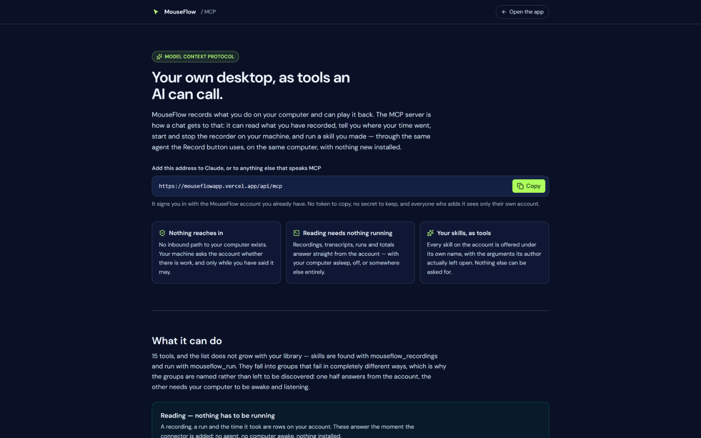

# 01 — Overview

## What MouseFlow is

Two things, sharing one account:

1. **A recorder and replayer.** Record what you do with the mouse — on a web page or across the whole
   desktop — read it back as prose, keep it as a reusable skill, replay it, chain several into a flow.
2. **An agent that works from a written goal.** Describe an outcome in a sentence; a model looks at the
   screen (or at the page), decides what to do next, and carries it out on the real machine.

Both halves produce the same kind of object — a *flow* on your account — and both are measured the same
way on the Dashboard. Recordings are compatible with [Mini Mouse Macro](https://www.dopesoft.co.uk/)
`.mmmacro` files in both directions.


*The app: the sidebar, the agent's own status in the top bar, the recorder, and everything this
account holds.*

## The three clients

| | Runs where | Aims at | Can reach |
|---|---|---|---|
| **Web app** | Vercel (static build + serverless routes) | — | The UI, the library, the transcripts, the Dashboard |
| **Desktop agent** | The user's own machine, loopback HTTP | Screen coordinates | Any application on the machine |
| **Chrome extension** | The user's browser | Page elements (selector + fraction of the box) | One browser tab |

The web app is the only place with an account. Neither the agent nor the extension can act as the user
against the server: the agent has no credentials at all (by design), and the extension carries a
user-pasted **device token**.

There is a fourth client, and it is the first one that is not a person: an **AI connected over MCP**.
It reads the account through the same routes the app does, and asks for work on the machine through a
queue the agent empties — it has no path *into* anybody's computer, because none exists. See
[21 — MCP](21-mcp.md).

### Why there are three and not one

A browser tab can only observe pointer input **inside its own window** and can only synthesize events
**inside its own DOM**. There is no web API for a global mouse hook or for injecting real OS input —
deliberately, because that is a keylogger primitive. WebHID refuses the Generic Desktop mouse and
keyboard collections by name, on the stated grounds that raw access enables input loggers.

So the desktop agent is not a shortcut; it is the only shape that reaches a native application. And the
extension is not a lesser version of it: aiming at page *elements* survives a resize, a layout shift and
a different screen resolution, which coordinate recording never can. They are two different trades, and
each flow carries which one made it (`source: 'web' | 'desktop'`) so the wrong half is never offered a
Run button it cannot honour.

## Architecture, one page

```
   ┌──────────────────────── the user's machine ────────────────────────┐
   │                                                                    │
   │   Chrome                                    Desktop agent          │
   │   ┌──────────────────────────┐              ┌──────────────────┐   │
   │   │ MouseFlow web app (tab)  │◄─loopback───►│ 127.0.0.1:8787   │   │
   │   │  React 19 / Vite         │   HTTP       │  Windows: .ps1   │   │
   │   │  localStorage: drafts    │              │  macOS:  Swift   │   │
   │   └───────────┬──────────────┘              │  tray / menu bar │   │
   │               │ postMessage                 └──────────────────┘   │
   │   ┌───────────▼──────────────┐                 hooks + SendInput   │
   │   │ MouseFlow extension      │                 or event tap + CGEvent
   │   │  worker + content script │                                     │
   │   └──────────────────────────┘                                     │
   └───────────────────┬────────────────────────────────────────────────┘
                       │ https, same-origin session cookie
                       │ (extension: Bearer mf_… device token)
   ┌───────────────────▼────────────────────────────────────────────────┐
   │  Vercel                                                            │
   │   /api/auth/*     proxy to Neon Auth (makes the cookie first-party)│
   │   /api/sync       flows, runs, device tokens                       │
   │   /api/transcript one recording, read and edited                   │
   │   /api/insights   the Dashboard's numbers, counted in SQL          │
   │   /api/chat       the grounded assistant + read-only tools         │
   │   /api/claude     the shared model key, held server-side           │
   │   /api/gallery    published skills (reading is public)             │
   │   /api/chats      saved conversations                              │
   │   /api/account    erase everything                                 │
   │   /api/models     which models this deployment can actually reach  │
   └───────────────────┬────────────────────────────────────────────────┘
                       │
              Neon Postgres  (neon_auth."user" + this app's own tables)
```

Two rules hold this together and are worth stating before any module:

- **The model never recalls, it explains.** Nothing about an account is in a model's memory. The
  assistant is given read-only tools, the server runs the SQL, and every answer lists the lookups it made
  and the runs it cited. See [08 — Dashboard and the assistant](08-dashboard.md).
- **Derivation happens in exactly one place.** A recording becomes prose only in
  `api/_transcript.js`; a picture-space coordinate becomes a screen coordinate only in
  `actionBody()`. A second implementation of either would let two screens describe the same thing
  differently, both looking authoritative.

## Capability matrix

What each executor can actually do, which is the question every screen in the product has to answer
before it offers a button:

| | Desktop agent | Chrome extension |
|---|---|---|
| Record mouse path, clicks, scrolls | yes, screen coordinates | yes, page elements + path |
| Record drags | yes | yes |
| Record keystroke **timing** | yes (`canKeys`) | no |
| Record typed **text** | **never** | **never** |
| Name what a click landed on | yes (`canName`): app, window, control, type | yes: selector, tag, visible text |
| Screenshots | yes (`canSee`) | no — it does not work from pictures |
| List open windows | yes (`canWindows`) | tabs only |
| Replay | yes, anywhere on the machine | yes, inside tabs |
| Aim a replay by name | yes (`#ctx` on the press) | inherent — it aims at elements |
| Long sessions (hours) | yes (`canDrain`, 0.8.0+) | no |
| End a recording at the agent | yes (0.8.2: tray / menu bar) | no |
| **Carry out a goal skill** | **yes, on its own since 0.9.0** — one turn per request, no second program on the machine | as it is today |
| Reach a native application | yes | no |
| Survive a page redesign | no — coordinates | mostly — selectors and text |
| Zero install | no | yes |

`canSee` / `canWindows` / `canName` / `canKeys` / `canDrain` are reported by the agent on `/health`.
A missing flag means the agent predates it, which is an answer; `canKeys: false` specifically means the
keyboard hook failed to install. See [10 — Agent protocol](10-agent-protocol.md).



*[`/mcp`](https://mouseflowapp.vercel.app/mcp) — the public page about the fourth client, readable
without an account.*

## What the product deliberately does not do

- **Capture typed text.** On either half. A keystroke is recorded as *an event with a timestamp and
  nothing else* — never which key. This is not a redaction design: there is nothing to redact, and that
  is the point. The consequence is stated everywhere it matters: a recording containing typing cannot be
  replayed faithfully, and the replay reports how many events it skipped as `unplayable`.
- **Estimate.** No screen invents a number. Where the stored data cannot answer a question, the
  endpoint returns it in a `gaps` list and the page prints it under its own heading.
- **Publish anything by itself.** A recording goes to your own account; putting a skill in the shared
  gallery is a separate, deliberate act, and withdrawing it is another.
