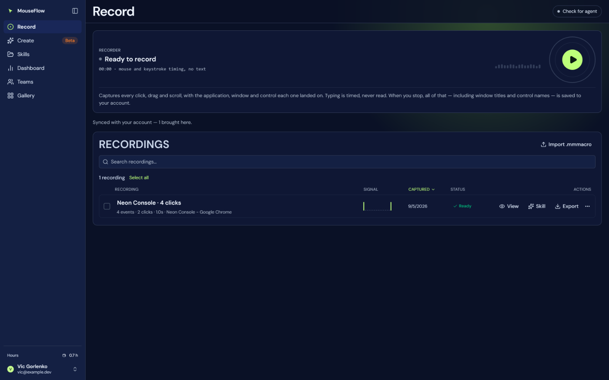
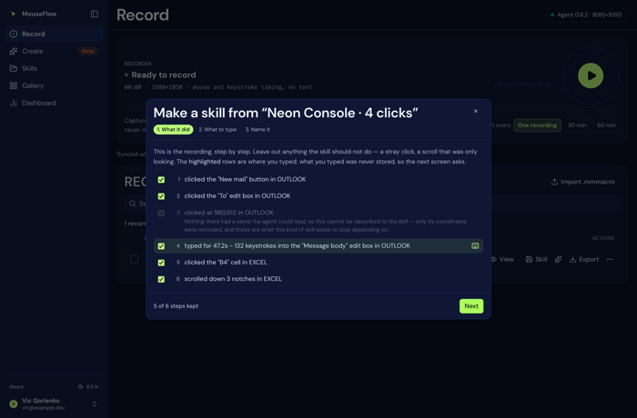
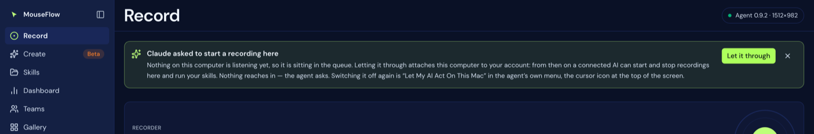

# 04 — Record

`/record`. Three things: the recorder, the recordings, and the transcript. Files:
`web/src/features/record/`.

## The recorder card

One card, one height, three states. What varies between them is **words inside a footer that always
exists** — never whether a block is there — because the card used to change height every time capture
started or stopped, and what moved was the whole list underneath it.

| Element | What it says |
|---|---|
| Status dot + heading | `Ready to record` / `Recording` (the dot pulses red while live) |
| Readout | `mm:ss`, the screen size, and while live the event count and window count |
| Live signal | Sixteen bars driven by the **event count**, not by a clock — so a still meter over a running clock means the recorder is seeing nothing, which is worth noticing. Deterministic in the count, so the movement is data changing rather than an animation running. |
| The disc | 56px idle (green, play triangle), 80px live (red, stop square), inside a fixed 128px box so the row cannot resize with it. Three staggered ping rings while live, dropped under `prefers-reduced-motion` while the red ring and the clock stay. |
| Footer | One line: while idle, whether this agent cuts a full recording itself; otherwise whatever the recorder needs to warn about |

**Record stays enabled with no agent.** Pressing it navigates to Connections and says so. A disabled
button is a dead end: it says no and not why.

### What a recording deliberately does not contain

Three things, and each of them was a leak that had to be found in a real transcript rather than reasoned
about beforehand.

**Typed text.** The keystroke is recorded, never the character. See `Key Down` in `agent/PROTOCOL.md`.

**A control name longer than 60 characters**, from agent 0.13.0. The accessibility name of a chat message IS
the message, and no type distinguishes content from a label — in Outlook an `option` runs 275–376 characters
and a `radio button` 174, the same types that carry three-character labels. Length does: over three
applications' live trees the longest name on anything a person *presses* was 43 characters, and File Explorer
had nothing over 60 at all. Above 60 the name is dropped and its LENGTH is written in its place, so a
transcript still says `clicked a group holding 147 characters of text (not recorded)` — enough to place the
step, nothing to leak. The rule is applied when reading too, because recordings made before 0.13.0 already
contain the text.

**The query string of a window title that is an address.** A page with no `<title>` is titled by its URL, and
a sign-in redirect is exactly such a page: `auth.doubleword.ai/u/login?state=hKFo2SAw…` — a one-time sign-in
token. `PageUrl` had always cut the query off the `url` field for that reason; the title walked around it.
Only when the whole title parses as an address: a title that merely contains a question mark is a sentence.

What is **not** redacted is written down in
[19 — Limits and known gaps](19-limits-and-known-gaps.md): short content, and titles themselves.

## What the footer warns about, and when

In priority order:

1. Any note from the last action (what was captured, what failed, what synced).
2. `canName !== true` — "This agent does not read what you click on, so a recording will be coordinates
   only." Said **before** the recording rather than discovered in the transcript afterwards: nine seconds
   of work is cheap to redo, nine minutes is not.
3. `canKeys === false` — the agent is current but the keyboard hook failed to install, so time spent
   typing will read as a pause. Everything else records normally.
4. Otherwise the ordinary caption, plus one line about the automatic cut.

## Recording, moment by moment

Pressing Record calls `POST /record/start` and starts **two pollers at different cadences on purpose**:

- **250 ms** — `GET /record/status`: the count and the elapsed clock, so the meter feels live. This is
  also where a full recording decides to cut itself, and where a recording ended at the agent is noticed.
- **1000 ms** — `GET /windows`: the foreground window, appended to a first-touched list. One sample a
  second at most; an application you passed through for half a second is not what the flow is about.

The effect is keyed on **whether** a recording is live and nothing else. It once depended on the object it
was itself rewriting four times a second, so both intervals were rebuilt every tick and the one-second
sampler never reached its first tick — every desktop recording came out with `payload.windows` empty and a
transcript saying "No window was recorded". Everything else the poller needs travels by ref.

On stop:

1. `POST /record/stop` returns the events as `.mmmacro` text; `parseMacro` turns them into events.
2. The recording is named by **when** it was made, to the second: `MouseFlow 21/08 13:34:07`. A timestamp
   reads as a moment and sorts like one. (Window-title names were tried and aged badly — ten recordings in
   the same app were ten identical names. Minutes alone were tried too: three recordings inside one minute
   were three identical names.)
3. It goes into `localStorage` **and straight up to the account**, best effort. `syncedAt` is stamped only
   on a clean push, because the stamp is a fact about the account rather than a hope.
4. What travelled is said plainly: the events, the window titles and the control names go to the user's own
   account. That is what makes the transcript and the Dashboard possible at all.

## A recording that outgrows one row

There used to be a whole apparatus here — **sessions**: a 30/60-minute chooser in the footer, parts pushed
with a `session` mark, a ledger in localStorage, and a Sessions strip above the table. It is gone, and the
reason is worth the paragraph, because the same forces will offer to bring it back.

The apparatus rested on one premise: that a person knows *before pressing Record* that the recording will
come out long. A five-hour recording made as an ordinary recording disproved it — the account refused the
push at stop (`unpacks to more than 7813KB`), when choosing a session was hours too late. And when the
rescue cut it into session parts, they arrived and vanished: the recordings table excluded session parts by
design, and the strip read a ledger nothing had written. The product owner's verdict was the right one:
no separate block — the recording should cut *itself* when full, into ordinary recordings.

### How it works now

One reason to cut — **size** (the clock was only its proxy) — and one blade behind four doors,
`splitIntoRecordings` in `long-session.ts`:

| Door | When it cuts |
|---|---|
| **Live** | the status poller watches the agent's buffer; at `CUT_AT_EVENTS` (75,000) it drains and saves an ordinary recording, named by the moment like any stop. The card's timer restarts from zero — by subtraction from the agent's own clock, never a second timer. Needs `canDrain` (agent 0.8.0+) |
| **Stop** | anything too big for one row (`FIT_TARGET_BYTES`, 6MB against the account's 8MB cap) is split right there — this is also what covers an old agent that cannot drain |
| **Put it back** | the recovery button splits instead of repeating a refusal that cannot change |
| **Import** | a file exported from a too-big recording splits on the way in |

A part is an **ordinary recording**: deterministic id (`<id>-pN`, so a retry rewrites rather than doubles),
a local row without events (`eventsOnAccount` — the same mechanism recordings already use when the browser
is full), `summary` precomputed so the table has numbers to show. On a failed push the parts stay local
*with* events — each under the cap, so the reconciler retries them one by one, and none can poison a sync
batch the way one oversized row did (the success stamp is all-or-nothing per batch).

**Why 75,000 events.** The poller only knows the buffer's event count, so the threshold must hold at the
worst *measured* event weight: 75,000 × 69 bytes ≈ 5.2MB, inside the 6MB target. The number this replaced —
4,500 — was sized for the old 400KB cap and would cut twenty times too often. Where the events are already
in hand (stop, restore, import), the weight is not estimated at all: they are serialised once and the
per-part count comes from their actual size — the five-hour recording weighed ~52 bytes an event, and the
69-byte constant would have been off by half.

**What was deliberately not kept:** the `LONG_MOVE_MS` pointer thinning (it existed so time-based parts
would fit; size-based parts fit by construction, so a long recording now keeps full replay fidelity), and
the session grouping on the account. Rows from the old world still carry `payload.session`; they are simply
visible now, like everything else — the reconciler no longer hides them.

## Recordings table

A list you can work through, following the Insightis Chats Library. Columns: checkbox, **Recording**,
**Signal**, **Captured**, **Status**, **Actions**.

- **Newest first**, since the store appends and raw order buried the recording somebody just made at the
  bottom of the scroll.
- **Search** over name, window titles and process names. **Select all** / **Clear selection**, a count line
  (`12 recordings of 30` while filtered), and **Load more** ten at a time.
- The name is **editable in place** — renaming is the commonest thing anybody does to a recording, and a
  dialog for it would be three clicks.
- Sub-line: events, clicks, duration, and the windows it saw.
- **Signal** — where the events fall across the length of the recording, derived from that recording's own
  events.
- **Status** — `Skill saved` when a `dr_<id>` row exists on the account, `Ready` otherwise. Read from the
  account rather than from a flag here, because the skill is a separate row, not a property of the
  recording. "Cannot tell" reads as Ready: under-reporting is a smaller error than claiming a skill that
  may not be there.

### Row actions

*Skill opens the wizard — see [06 — Skills](06-skills.md#one-outcome-and-the-wizard).*

| Control | Does |
|---|---|
| Play (icon) | Replay now with this recording's own repeat / speed / loop |
| **View** | Open the transcript panel |
| **Skill** | Open the wizard: what it did, the instructions, the name |
| **Export** | Download `<name>.mmmacro` |
| **More** (ellipsis) | The replay settings, and Delete |

The More panel opens *under* the row rather than over it — a popover needs positioning, a click-outside, a
focus trap and a scroll listener to stay where it was put; this needs none of them and cannot end up half
off the screen. Inside:

- **Repeat** — 1 to 999
- **Speed** — 0.5x / 1x / 1.5x / 2x / 4x
- **Loop until stopped**
- **Play `N times` at `S speed`** — the settings are set here, so this is where a Play that says what it
  will do belongs. The icon on the row stays: it is the one you want when you have not touched anything.
- **Delete** — arms in the button ("Delete — press again"), with an explicit **Cancel**. Closing the panel
  disarms it, because a panel that reopened with its delete still cocked would be one click from deleting
  something with nothing on screen saying so.

Selecting rows adds a bar with **Export**, **Delete** (also armed) and **Clear** — which disarms as well as
clears, because the armed flag used to survive behind the hidden bar and bring Delete back already cocked.

### Import and export

**Import .mmmacro** takes several files at once (`.mmmacro`, `.txt`, `text/plain`). Each becomes a
recording *and is pushed to the account*, because a recording that only exists in this browser has no
transcript. What comes back from a file: the events, and the `#ctx` comments, so every click keeps the
application and control it landed on. What does **not**: the once-a-second window sample, and what the
agent could do when it recorded. The transcript reads both absences correctly rather than guessing at them.

Export writes the five-column Mini Mouse Macro layout, which is what makes a recording useful to somebody
who has never seen this app.

## Replaying one recording

Pressing Play on a row:

1. **Brings the application this was recorded in to the front** — `action=activate` on the first window the
   recorder saw, then 350 ms for the window to actually raise. A replay is coordinates and clicks: it has
   no idea what is under them, and if the window has been minimised every click lands on whatever happens
   to be there — a failure that looks like the recording being wrong rather than the desktop having moved
   on. Best effort, and the message says what was tried.
2. Sends a one-step flow with that recording's repeat / speed / loop and the console's start delay. A row
   *is* a one-step flow, which is why its settings are the step's: the alternative was a second replay path
   that could disagree with the flow builder's.
3. Polls `/replay/status` every 700 ms, so the page knows when it is over rather than claiming a replay
   forever.

**Escape aborts**, from anywhere on the page. The pointer is not yours while a replay runs, so the keyboard
has to be enough. The agent releases every held button and key on every exit path, including the failure
paths — a replay that died holding the left mouse button would leave the machine unusable.

## Recordings ended at the agent

The macOS menu bar's **Stop and Save Recording**, and the Windows tray's equivalent. Two collection paths,
both landing on the account identically:

- **While this page is open** — the 250 ms status poll sees `recording: false` with `count > 0` and calls
  the same `end()` the Stop button does, within a quarter second.
- **While the page was away** — a three-second check runs whenever the agent is up and nothing is live
  here, so a hold made with the tab closed is collected on arrival.

A held **session tail** is filed into its session rather than as a standalone recording: it is sliced under
`EVENTS_MAX_PER_PART` (which is the entire reason sessions exist — an overnight tail would be one giant
push the account refuses), pushed as that session's final parts, and the session is stamped finished **only
when nothing is left waiting**. A dangling session with nothing held is stamped too, or "still running"
would be pinned on the page forever.

Guards that matter here, each from a real failure:

- **One mutex for every door into stopping** — the button, the poller's collect, the mounted check. Two
  concurrent stops meant the loser took an empty body, said "Nothing was captured." over the winner's note,
  and in a session could commit a ledger missing the tail part the winner had just pushed.
- **Delivery is staged before the account is asked**, so a failed push keeps the events and retries.
- **The retry is paced by a timestamp**, not by the effect loop: a failed push changes state, which remakes
  the callback, which re-runs the effect at once — an unpaced hot loop hammering an account that may be
  down precisely because it is overloaded.
- **Record refuses to start while anything is pending**, because that list can hold the only copy of what
  Stop and Save promised to keep.
- **The newest** dangling session takes the tail, not the first: a row orphaned by an old crash must not
  swallow a tail belonging to yesterday evening's session.

## When a chat asks for a recording here

`web/src/features/record/WaitingForThisMac.tsx`. An AI connected over MCP can ask for a recording to be
started on this computer. If nothing here is listening yet, the request sits on a queue — and the app,
which is the only place somebody can say yes, says so:

**Let it through** attaches this computer to the account and what was waiting starts within seconds.
The banner renders only when something is genuinely queued **and** this computer is not taking work;
the moment either stops being true it removes itself. It polls `/api/mcp?pending=1` every 20 seconds,
and only while it could be the answer — an agent already taking work will pick the job up on its own,
and one too old to be attached has nothing to offer.

Consent arrives **with the request** rather than as a switch on a settings screen nobody opened, which
is both the friendlier design and the stronger one: the question is asked at the moment it means
something. See [21 — MCP](21-mcp.md#letting-it-act-on-your-computer).

## Cross-device reconciliation

Runs on load and on every change, from the shell rather than from this page — signing in on another machine
can land anywhere, and waiting for somebody to visit the right page before their recordings appear is the
same bug in a longer form. The rules are pure (`reconcile.ts`); the part that touches two stores and the
network is deliberately small (`Reconciler.tsx`).

Three directions, and the third is the one a naive two-way sync gets wrong:

| State | Action |
|---|---|
| On the account, not here | **Pull it down** — newest first, within the 3 MB budget |
| Here, never acknowledged by the account (`syncedAt` absent) | **Push it up** — it only exists here |
| Here, acknowledged, and now absent from the account | **Drop it** — it was deleted on another machine |
| Held by both, never stamped | **Stamp it** — not a change of content |

The trap: `api/sync.js` upserts with `deleted_at = null`, so re-pushing an id that was deleted elsewhere
**resurrects it**. "The account does not have this, therefore send it" would undo every delete made on
another machine, and the delete would come back looking like a sync. `syncedAt` is the one fact that
separates the two cases.

Recordings made before `syncedAt` existed have no answer. They are stamped on the first reconcile if the
account already holds them, and otherwise pushed — which can resurrect something deleted elsewhere *before
this existed*, once. That is the lesser harm: the alternative deletes a recording that may be the only
copy, and losing work is not recoverable while an unexpected row is.

Not treated as recordings, each for a different reason: skills (`role: skill`), created-skill ids (`dr_…`),
**session parts** (on the account by design — that is the whole mechanism), and rows with no events
(nothing to bring).

What it does is **said, not silent**: for a minute after a reconcile the page prints "Synced with your
account — 3 brought here, 1 sent up, 2 removed because another device deleted them." Recordings appearing
needs no announcement; recordings **disappearing** does.

Rows left on the account because this browser has no room are named too, and the orphan strip offers
**Bring it here** (for the one you actually want) and **Remove from the account** (armed). It is no longer
an offer to *sync* — signing in already does that, and an offer was the problem: it meant two devices could
quietly hold different sets.

## Transcript panel

Opens beside the list — fixed to the right, the page scrolling behind it — rather than expanding a row: a
row that expands to three hundred lines stops being a row.

Everything shown is a field `/api/transcript` sent. **Nothing here derives a fact from another fact**, and
that is the one rule this file cannot bend: a recording holds far less than a reader assumes, so a
confident sentence about something that was never captured is worse than a blank. Where the endpoint says
it cannot know, the panel prints that in place, and the `gaps` list gets its own heading rather than a
footnote.

Sections: the flow's name and when it was made; summary chips (events, clicks, scrolls, drags, keystrokes,
time spent typing, total); **what was captured**, in prose; the **story**; the **segments** with their steps
and an elapsed clock down the left; and **what this recording cannot tell you**.

Footer actions:

- **Create skill** — fetches the flow's payload from `/api/sync` (there is no per-flow read; it happens on
  the press, not on open) and writes a `mouseflow.skill/1` object stamped `role: skill`. A desktop
  recording is described from the transcript's own counts, because the extension's action-name-based
  describer answers "0 clicks" for one.
- **Ask about this** — hands the recording to the Dashboard assistant with a question naming both the
  recording and its id, then navigates there.
- **Put it back on the account** — offered only when this browser actually holds the events. It is the
  ordinary push applied again; worth a button because the failure it fixes is otherwise invisible (a
  recording deleted from Skills, where it looked like a skill, and the only sign is View breaking here).
- **Remove** — deletes the whole recording, armed in the button. Removing *steps* is a different act,
  driven from the assistant on the Dashboard.

Two things it deliberately does not read: the raw events (a transcript describes a recording; it does not
carry what replays it) and the step numbers as anything but display — `POST /api/transcript` owns removal,
and both sides must use the same numbering.
