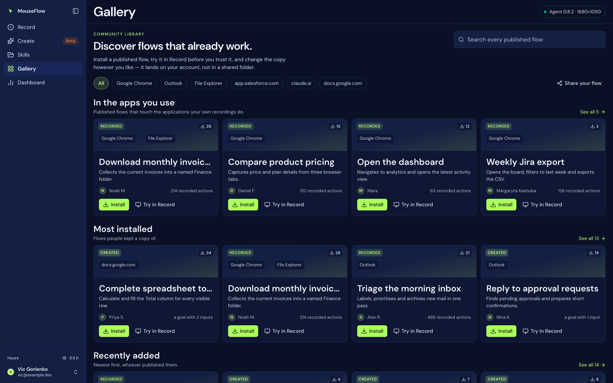
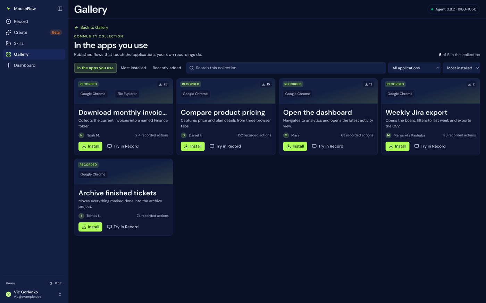

# 07 — Gallery

`/gallery`. Skills other people have published. Files: `web/src/features/gallery/`.

Reading it needs no account — it is public, which is what lets the extension install from it in one click.
Installing puts a **copy** on your account, so that is a signed-in act, and the copy is yours: rename it,
run it, change it.

## Two views of the same data

The second exists because the first cannot be both.

- **Browsing** wants rows: a few from each grouping, side by side, so somebody who does not know what they
  are looking for can see the shape of the library.
- **Looking for something** wants a grid: all of one grouping, filtered, sorted, paged.

A page that tries to do both ends up with twelve cards in no order anybody chose. Four cards to a row while
browsing, twelve to a page inside a collection — three rows of the first, so a collection opened from a row
keeps the rhythm the row had.

Which view is open is local state rather than a URL: nothing else in this app reads search params, and
adding that machinery for one panel would leave the gallery routed in a different style from every other
screen.

## The collections, and why these three

The design this was built from has *Featured*, *Most liked* and *Recently added*, and two of the three
cannot be told the truth here:

- **Featured** is an editorial pick, and nobody curates this gallery. A row labelled Featured would be
  ordinary rows in a hat.
- **Most liked** needs likes. There is no likes column; there is an installs column, and "people installed
  this" is a stronger claim than "people liked it" anyway — the same shape of row, ranked by something that
  actually happened.

So:

| Collection | Ordering | Notes |
|---|---|---|
| **In the apps you use** | most installed | Published flows that touch the applications *your own recordings* do. Absent for somebody with no recordings, and then the gallery simply opens on the next row. |
| **Most installed** | installs, descending | Only flows somebody actually installed. A ranking where every value is zero is not a ranking. |
| **Recently added** | newest first | Whoever published them. |

"In the apps you use" is first, deliberately: when two rows would show the same four cards the later one is
dropped, and if *Most installed* sat above it the personal claim would be the one that vanished — which is
backwards. "These run in your Outlook" says more than "these get installed a lot".

### How a row is dropped

Not by "these flows already appeared above" — that was the first version of the test, and it deleted
*Recently added* from a full library, because a gallery of fourteen where thirteen have been installed puts
nearly everything in *Most installed* first. A row is not there to introduce new flows; it is there to make
a **claim about an ordering**. Three orderings of overlapping sets is what a library looks like.

What a reader *does* notice is the same four cards in the same order twice. So the test is on the visible
slice: a row is dropped when the cards it would actually show are the ones a row above is already showing,
in the same order.

### Matching a flow to your applications

`origins` holds two different things depending on which half published: the extension records the sites a
flow ran on (`https://mail.google.com/…`), the desktop agent records window titles (`Inbox - Outlook`).
Neither is a name, so both are reduced to the one word a person would use — hostname without `www.`, or the
tail after the last dash, since Windows puts the application last.

Your own applications come from your recordings' window titles **and** process names: "chrome" never
appears in "Inbox - Outlook", and a flow published from a browser lists hostnames no window title will
match. The comparison is containment either way with a three-character floor (two would match "in" against
everything).

## Browse view

Per row: the title, one line saying what the ordering means, the first four cards, and **View all** when
there are more. Above the rows: a search over every published flow (debounced 250 ms, server-side over name
and description), and the count — `50 of 148` when the endpoint reports a total, otherwise just what
arrived, because claiming more would be inventing it.

## Collection view

Opened from a row. The heading is the collection's own, and then:

| Control | Behaviour |
|---|---|
| **Back** | to browsing |
| **Search this collection** | over everything a card shows — name, description, author, and the application chain. The server searches name and description only, which is right for finding a flow nobody has scrolled to; inside a collection the question is "which of these touches Excel", and the app chain is part of what somebody just read. |
| **Application filter** | the distinct applications across this collection, most common first. Counted once per listing: a flow that visits Gmail eleven times is one flow that uses Gmail. |
| **Sort** | Most installed / Newest first / Name, A to Z |
| **Pagination** | 12 a page |

## The card

The design this follows puts a graphic band across the top with three or four linked boxes in it. Drawing
that literally would be decoration, so the boxes hold the one thing a flow has that looks exactly like that
and is **true**: the applications it moves through, in the order it touched them. A flow that goes Outlook
then Excel then Chrome *is* a chain of three, and a reader learns whether it belongs to their work before
reading a word of the description.

Four applications, then a count — a flow touching nine tells you more by saying nine than by listing nine.
The band's height is fixed so a row of cards lines up whether their flows touch one application or nine.

Also on the card: the kind (`recorded` / `created`), the name, the description, the author and their
picture, the install count, and the size **in the unit that kind of flow is measured in**:

- recorded → `142 recorded actions` (and `recorded actions` with no number when the deployment is too old
  to send the count — `actions: null` is distinct from `actions: 0`)
- created → `a goal with 2 inputs`, or `a goal, no inputs`

Reporting "0 steps" for a created flow would describe a flow that does nothing, which is the opposite of
true.

**Not** on the card: a like count, a verified badge, an editorial star. None of the three exists in the
data, and a number nobody can produce is worse than a gap where it would have been.

## Install, and Try

**Install** fetches the full listing (which also counts the install), then pushes a copy to your account:

| | |
|---|---|
| Id | `gal_<gallery id>` — so installing again **overwrites that copy** rather than making a second one, and so the button can say `Installed` |
| `source` | Decided by what the payload **points at**, not by where it came from: an `agent: 'desktop'` marker means a desktop flow, and the extension must not be offered as a way to replay it |
| Result | *"Installed "…". It is in Skills — the copy is yours."* |

**Try** (desktop flows) adopts the payload straight into the Record console and navigates there, without
putting anything on the account. A listing with no events says so rather than adopting nothing.

## Publishing, and withdrawing

Publishing happens from [Skills](06-skills.md), never from here, and never on its own. What goes up is the
skill exactly as the extension's format defines it, kept whole rather than shredded into columns — the
format is versioned and owned by `extension/skills.js`, and re-deriving it from columns on the way out
would give two definitions of the same thing that could disagree.

Alongside it, denormalised so a listing renders from one table: the author's name and picture, the name,
the description, the kind, the origins, the install count and the publish time.

**Withdrawing is a soft delete** (`withdrawn_at`): an unpublished skill that somebody already installed
should not become a broken link. Erasing your account withdraws your listings rather than deleting them,
for the same reason — the copies other people hold are theirs.

Search is deliberately limited to name and description. **The payload is not searchable on purpose**: a
goal can contain an address or a document title, and a gallery is public.
