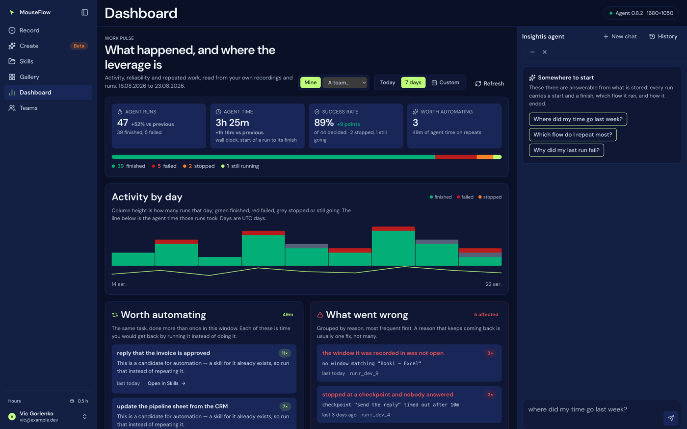
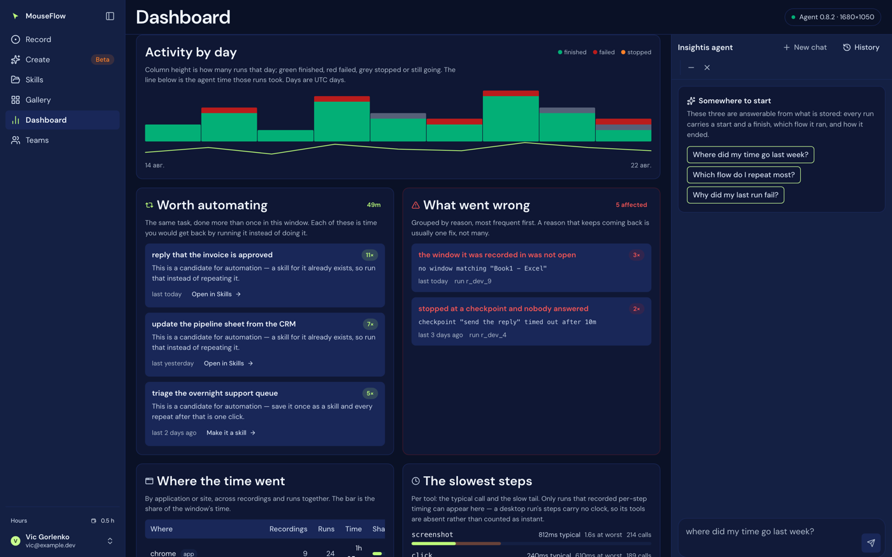

# 08 — Dashboard, and the assistant

`/dashboard` (also `/insights`, the old path, kept because it is linked from a published roadmap review).
Files: `web/src/features/insights/InsightsView.tsx`, `web/src/features/chat/ChatView.tsx`,
`api/insights.js`, `api/chat.js`, `api/_recording-tools.js`, `api/chats.js`.

Two things on one page, deliberately: the numbers, and something you can ask about them. They were two
screens once, and a separate address made somebody retype the window they were already looking at.

## The rule the whole page rests on

**No derived arithmetic.** Everything shown is a field `/api/insights` sent. Where the stored data cannot
answer a question, the endpoint says so in `gaps` and the page prints it under its own heading. Inventing a
plausible number is worse than admitting the gap, because a made-up number gets believed.

There is also **no chart library**: every mark is a `div` or a line of inline SVG. A dependency for eight
bars would be the largest thing in the bundle.

*Every figure is a field `/api/insights` sent; nothing is
derived in the browser.*

## Controls

| Control | Behaviour |
|---|---|
| **Today / 7 days / Custom** | The range. A control, not a filter buried in a menu — it is the first thing anyone changes. 30 and 90 were presets and were removed: three presets plus a calendar is four controls answering one question, and a quarter of runs is a range you pick with real dates. Custom still reaches the server cap of 365. |
| **Refresh** | Re-reads the window. |
| **Ask about this** | Brings the assistant panel back. It is only shown when there is no other way in: the panel carries its own minimise and close, and minimised it leaves a rail on the right edge. The state is remembered (`mouseflow.insights.assistant`: `open`, `min` or `closed`), and so is its width. |
| **Mine / a team** | Whose numbers. Only shown to somebody who owns or administers a team; see [Whose numbers](#whose-numbers). |
| **Everybody / one member** | Narrows a team view to a single person. Appears once a team is being shown. |

## Whose numbers

Yours, unless you switch. An owner or an admin of a team can point this page at that **whole team** — every
member's recordings, runs and skills, counted exactly the same way. It is the only place in the product
where one person's screen adds up somebody else's work, so three things hold it in place:

- **The switch is offered only to somebody who owns or administers a team.** `api/_team-scope.js` checks the
  role again on every request; a control that is merely hidden is not a rule. A member who edits the address
  is refused by name, and a team they are not in at all answers `404` — which does not confirm it exists.
- **The scope is in the address** (`/dashboard?team=t_ab12`), so a link opens what the sender was looking at
  and a screenshot of "47 runs" can be traced back to whose.
- **The team view shows work, not screens.** Precisely — because a vaguer claim was made here first and it
  was too strong. Visible to a team's owners and admins: counts, durations and outcomes; application and
  process names, and for older desktop recordings the *window title* where that is the only thing naming
  one; skill and recording names; the **goal wording** of runs that happened more than once; and the
  **reason text** of failures. Not visible in any scope: the events inside a recording, its transcript, its
  chat, or per-step detail of what was clicked. Nothing anybody typed exists anywhere in this product to be
  shown. The line is *work product a manager can already see on the roster*, not *only numbers*.

The team view adds a **Who did what** table — one row per member, over the window on screen — and gives the
skills table a *Whose* column. Everybody gets a row, including the people with nothing in the window, since
a table that silently omits a quiet fortnight reads as a roster with somebody missing.

### One member at a time

A second control narrows the team view to a single person (`&person=<uuid>`), which is how a manager asks
"and how is one person getting on" without reading nine people's numbers as one. The permission does not
change — it selects a subset of accounts the caller could already count, and `api/_team-scope.js` checks the
id is actually in that team, because a uuid in a query string is no more a permission than a team id is.

Two details that keep it honest. The **roster stays whole** while the counting narrows, so the picker still
offers everybody — a filter you cannot get out of is a dead end. And the **Who did what** table disappears
while one person is selected: a one-row table under a header that already names them is noise, and a table
still summing the whole team under a header counting one person is a contradiction.

### The assistant follows the scope

It used to be switched off on the team view, because it reads one account and would have answered about your
six runs beside a header counting the team's ninety. It now takes the same scope the page does — team, or
one member of it — resolved through the same `api/_team-scope.js` check, so the panel can only ever read
what the page beside it was allowed to count.

What it may reach in a team scope is a **whitelist**, not the personal tool set with the dangerous parts
removed: `summarize_time`, `list_skills`, `find_repeated`, `search_runs` and `team_people`. Three things are
deliberately absent, and each would be a real breach rather than an untidiness:

| Absent | Why |
|---|---|
| `get_run` | returns a run's steps — per-moment detail of a colleague's screen |
| `get_transcript`, `list_recordings` | the transcript of a recording, and window titles out of its payload — the content half of the line `db/008_team.sql` draws |
| `remove_steps`, `undo_edit` | **writes**. An owner editing a colleague's recording from a chat panel is not a reporting feature |

A whitelist because the failure modes are not symmetrical: a tool wrongly left out makes an answer worse, a
tool wrongly left in hands somebody another person's work. New tools are personal-only until somebody adds
them to that list on purpose. The panel also labels whose history it is reading, and its three starter
questions change with the scope — "Where did my time go last week?" is the wrong question to offer beside a
header counting nine people.

The full account of the roles is in [22 — Teams](22-teams.md#the-teams-dashboard).

## What is counted, and how

One read-only transaction per request. Not tidiness: the totals, the day series and the per-application
split have to **agree with each other**. Eight separate queries with a sync landing between two of them
produces a page whose header and chart contradict each other, and no reader can tell which half is wrong.

Where the time numbers come from, precisely:

| | |
|---|---|
| A recording | `payload.events` carry the pause since the previous event, and a browser `path` event's points carry a `dt` each. The sum is real, measured, elapsed time. **Both spellings are read** — the extension writes `delay`, the desktop recorder writes `delayMs` — because assuming one silently gives the other half a duration of zero. |
| A run | `started_at` to `finished_at` is wall clock. An extension run's steps also carry a per-step `ms` and the page each step acted on, which is the only per-application timing anywhere in the schema. A desktop run's steps carry `{ tool, input }` and no timing at all. |

Two thresholds, and both are duplicated in the transcript engine **on purpose** — if one changes without
the other, the Dashboard and a transcript will report different durations for the same recording and both
will look authoritative:

- **`EVENT_GAP_MAX_MS` = 120 s.** A longer gap inside a recording is somebody away from the machine, not
  time in an application. The part beyond it is **dropped**, not bucketed, and how much was dropped is
  reported — so the drop is visible rather than quietly flattering.
- **`RUN_MAX_SECONDS` = 12 h.** A longer run is two machines' clocks disagreeing, not a run.

Anything that cannot be attributed to a named application goes in **one** bucket and is reported. Spreading
it proportionally would make every number slightly untrue and none of them checkable.

## The sections, in the order they are read

The page is scanned rather than read, so it is built in that order: the shape of the window first, then the
things that want a decision, then the flat tables.

| Section | Holds |
|---|---|
| **Header cards** | Runs, and how they ended. Success rate = finished ÷ (finished + failed) — stopped and still-running are left out of **both** halves. Agent hours (wall clock). Recordings and created skills. A comparison against the previous window of the same length, which states whether there *was* one rather than inferring it from a zero. |
| **Activity by day** | Runs per day, with the finished/failed split. Bars, scaled to the tallest day. |
| **Worth automating** | Goals that ran more than once in the window, with the times and what those runs took. **Not a saving** — the tooltip says so, and so does the gaps list. Matching is on identical goal text (see the limit below). |
| **What went wrong** | Failure reasons, grouped, with how often and an example run. |
| **Where the time went** | Per application (or per origin for browser flows): recordings, runs, seconds and share. Plus the **unattributed** slice as a named row with its own explanation, so the shares add to one and a dataset where most time cannot be placed *looks* like one. |
| **The slowest steps** | Per tool: calls, median, p90. Only tools called at least twice — a median over one call is that one call wearing a hat. |
| **How each skill is doing** | Per flow: runs, finished, failed, median seconds, last run. |
| **What this cannot tell you** | The gaps, under their own heading. |

Every list is capped and **every cap is reported with the total it was cut from**, so the page can say "top
12 of 34" instead of implying it is everything: applications 12, repeated 10, slowest steps 10, failures 10,
skills 20.

## The gaps

First-class, not a footnote. Each is a question somebody will ask of this page and the reason the stored
data cannot answer it, with the real count from *this* window — so a gap that has stopped applying shows a
nought rather than being a warning nobody rereads.

**They are no longer printed at the bottom of the page.** Read there, unasked for, they came across as a
disclaimer rather than as what they are, which is answers. They are still in the endpoint's response and
the assistant reads them, so "why does this not tell me what I saved" gets those exact words at the moment
somebody asks the question — which is where an answer belongs. Among them:

- **How much time did this save me?** Nothing holds how long the same task takes by hand, and there is no
  field for it. Every "time saved" number in a product like this is a baseline somebody typed.
- **Where did the time go inside a desktop run?** A desktop run's steps carry only the tool and its input.
  Only the whole-run duration is known.
- **What did the model say while running?** `user_run.said` is empty on most rows.
- **Was that really the same task twice?** `find_repeated` matches **identical** goal text. Two goals
  differing by one name are not clustered: there is no similarity index here, and a LIKE-based guess would
  be presented as a finding.
- **Skill-by-skill totals over all history** — `user_run.flow_id` was NULL for every historical row and is
  only now being written, so anything grouped by skill covers recent runs only.

## The assistant

A panel beside the numbers. `POST /api/chat`.

### What makes it worth trusting

**The model explains the data; it never recalls it.** It has no memory of this account and cannot have one.
It is given read-only tools, the server runs the SQL, and the model writes prose over the rows that came
back. Every lookup is listed in `used` and every run those lookups touched is listed in `citations`, so an
answer can be **checked** instead of believed. That is the difference between a grounded answer and a
confident one.

The grounding is part of the answer rather than a disclosure underneath it: each reply shows the tools that
actually ran and the runs it cited, and a citation is a **button** — pressing it prints that run's own id,
goal, outcome and timing, read out of the rows this page already holds. And the corollary, which is why the
warning is worded the way it is: **when the server cites nothing, the screen says the answer is general.**

### Scoping, which is not negotiable and not delegated

Every query filters on the user id `whoIsCalling()` returned, inside the `WHERE` clause, and **not one tool
takes a user id as an argument**. A model-supplied user id is the whole bug class here: one hallucinated
uuid and this becomes a route that reads somebody else's history. The schemas say
`additionalProperties: false` as a hint to the model; the real guarantee is that no code path reads an id
from tool input.

The transcript is rebuilt from the caller's `history` as **text turns only**, never as tool calls and tool
results. A caller who could post tool results could hand the model invented rows and have them answered as
though they came from the database — which is exactly the property this route exists to provide.

### The tools

Account-wide (`api/chat.js`):

| Tool | Arguments |
|---|---|
| `search_runs` | `days` (≤365), `outcome`, `flowId`, `contains`, `limit` (≤50) |
| `get_run` | `runId` — the goal, outcome, timing and up to 60 steps |
| `summarize_time` | `days`, `groupBy: day \| application \| skill` |
| `list_skills` | `kind`, `limit` |
| `find_repeated` | `days` (default 90) — identical goal text, run more than once |

One recording at a time (`api/_recording-tools.js`, registered alongside):

| Tool | Arguments |
|---|---|
| `list_recordings` | `limit` (≤40), `source: web \| desktop` |
| `get_transcript` | `flowId`, `fromStep`, … — the same derivation the panel shows |
| `remove_steps` | `flowId`, the step numbers — **the only tool in the assistant that writes** |
| `undo_edit` | `flowId` — puts the previous payload back |

The derivation is **not repeated** in the tools module. `api/_transcript.js` turns a payload into a
transcript and is the only thing that does; a second derivation would drift, and then the panel on the
Record screen and the assistant beside it would describe the same recording differently, both looking
authoritative. It is imported **lazily**, so a missing file is reported as one tool that cannot run rather
than taking the whole assistant down.

### The one write, and its four guards

`remove_steps` exists because the assistant is where "remove those steps" is actually said. The failure it
is built around is not a database error — it is a model that misread the numbering and removed steps 4 to 6
of the wrong list.

1. The numbers are resolved against a transcript built from the payload **as it stands now**, and an
   out-of-range number aborts the **whole** call. A number the transcript does not have is evidence that the
   numbering in play is not this recording's; applying the half that happened to be in range is exactly the
   accident. Nothing is written, and the message says the real range.
2. The result describes what was removed in the **recording's own words** — the action and target of each
   removed step — rather than echoing the numbers it was asked for. A wrong removal is then visible in the
   answer, to somebody who was there.
3. The write is conditional on the revision the payload carried when it was read, so an edit made in the
   panel in between makes this fail instead of overwriting it.
4. Nothing is destroyed. The previous payload is kept and `undo_edit` puts it back; the last five versions
   are kept, and no more, because they compete for room with the recording itself.

### Limits and shape

| | |
|---|---|
| Rounds of lookups | 6 per question. Enough for "find the runs, open the worst one, check what else that day looked like", small enough that one question cannot become thirty model calls. On the seventh no lookup runs whatever the model asks for, and the answer says that is what happened. |
| Question | 2,000 characters |
| History kept | 16 turns, 4,000 characters each |
| Answer | 2,000 tokens |
| One tool's output | 12,000 characters, ≤50 rows, ≤60 steps, ≤30 groups |
| Providers | Anthropic (exercised daily) and OpenAI (written against the Responses API, **not** run from here — there is no key on the deployment yet) |

Both providers go through `api/_provider.js`, which normalises the conversation and — the part that matters
more — normalises **how a turn ended**: `end | tools | truncated | refused`. A truncated turn and a refusal
are not answers, and this route returns an error for both rather than presenting half a sentence as a
finding. Both decision loops in this product have filed a truncated turn as a successful run once; this does
not repeat it.

### Privacy, said plainly

Everything a tool returns goes into a prompt and is sent to the model provider — named back in `provider`.
That includes goals exactly as typed, which routinely carry an email address and the text of a message, and
step inputs, which carry whatever was typed into a page. **There is no way to answer "what did I do last
week" without sending what was done**, so this is a property of the feature rather than an oversight in it.

What is held back is the one class where sending it is never needed: text shaped like a **credential**.
Email addresses are deliberately not masked — "who did I write to" is a fair question about one's own
history, and masking would make it unanswerable.

## Saved conversations

`api/chats.js`, tables `chat_thread` / `chat_message`. Until these existed a thread lived in React state and
a reload was the end of it, which makes the assistant a calculator rather than something you can come back
to.

- **The client owns the ids** — a conversation exists in the page before it has ever been saved, and the
  first save must not round-trip for an id to attach messages to.
- **A conversation names itself** from its first question, trimmed. Nothing asks anybody to title one.
- The message index `n` is part of the key, so re-saving a turn overwrites it rather than appending a second
  copy: the page saves after every reply, and a retried save must not double the thread.
- **What the reply was grounded on is stored with it** (`meta`), so a reopened conversation shows the same
  "based on" panel it showed when it was new. An answer without its evidence is a claim, and this app's
  whole position on the assistant is that it does not make claims it cannot show the source for.
- **Delete means delete here**, unlike `user_flow`. A flow is tombstoned because two machines sync it and a
  delete has to propagate; a conversation is written by one client, read by one person and reconciled by
  nothing. Asking for a conversation to be forgotten and keeping it with a flag set would be the wrong
  answer to a reasonable request.

## Asking about one recording

The transcript panel's **Ask about this** hands the recording to this assistant and navigates here. The
question names both the recording and its id — the id is what `get_transcript` needs, the name is what a
person will recognise in the reply:

> Analyse my recording "MouseFlow 21/08 13:34:07" (id r7k2x9qa). What happened in it, where did the time
> go, and is there anything in it worth automating or cutting?

Taken exactly **once**. Opening the Dashboard again by hand must not re-ask the last question — that would
put the same request at the top of an empty thread every time somebody navigated here, which reads as the
app deciding what you wanted.

## Deliberately not here

- **Markdown rendering.** The reply is plain pre-wrapped text. No renderer is vendored, and a half-hearted
  regex one turns `**bold**` into noise.
- **What a run said.** `user_run.said` is never handed to the model; a citation shows goal, outcome and
  timing.
