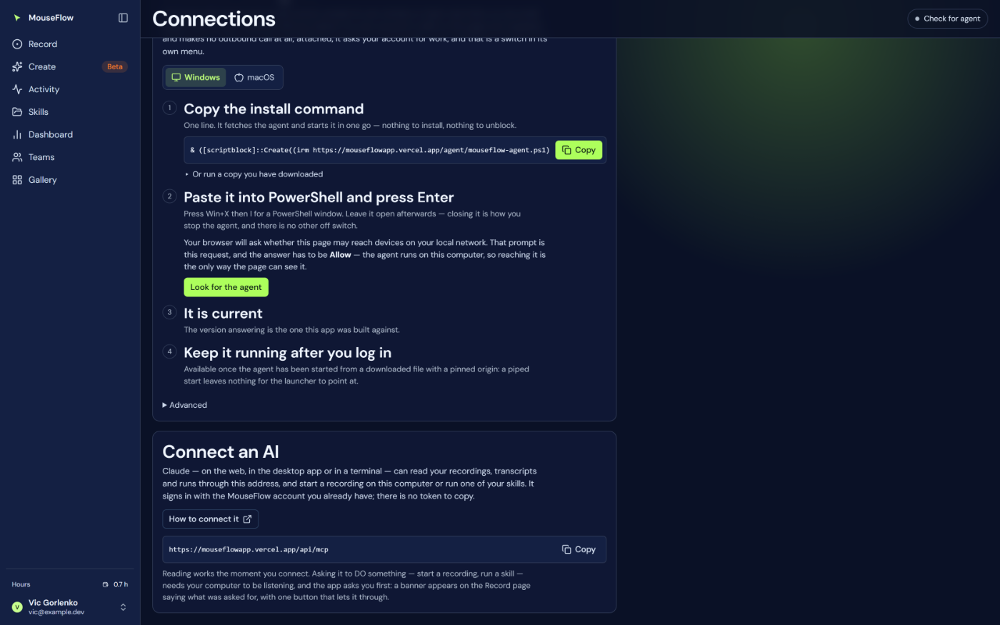
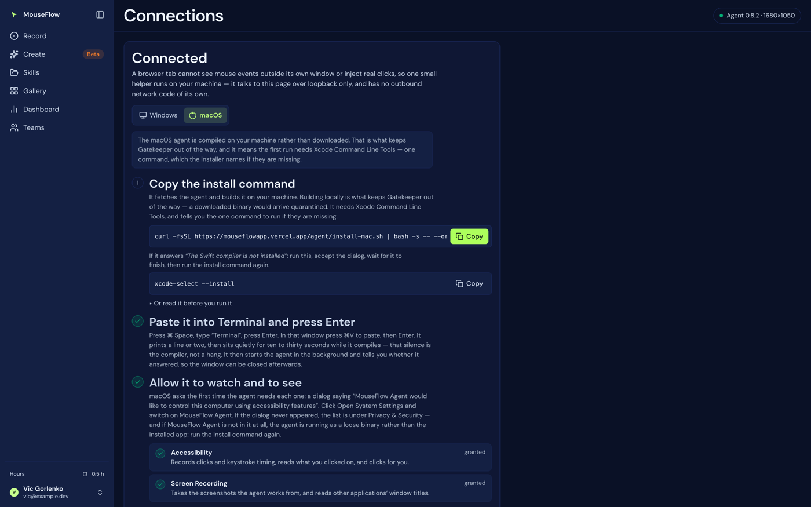
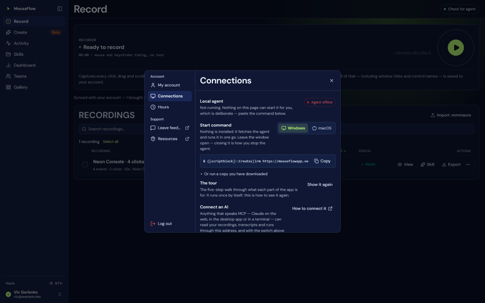
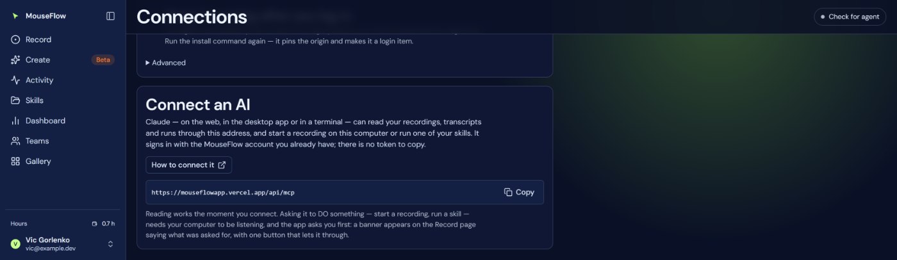
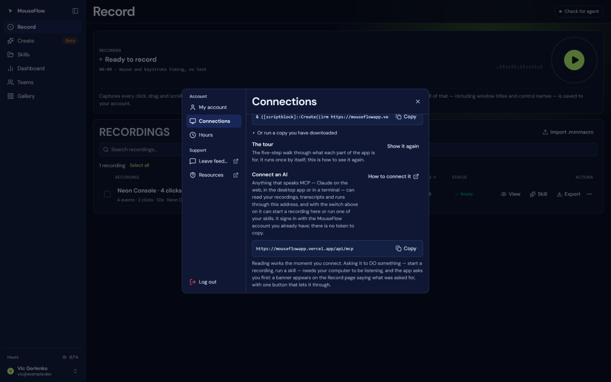

# 09 — Connections

`/connect`, and the same content as **Settings → Connections**. Files:
`web/src/features/connect/ConnectView.tsx`, `web/src/features/connect/platform.tsx`.

Not in the sidebar: it is setup, not a place you work. Reached three ways, each at the moment somebody
needs it — the account panel, the agent status pill in the top bar, and pressing **Record** with no agent
running.

The steps are the ones that actually go wrong, in the order they go wrong in. Each one **detects** that it
is done rather than asking you to confirm it.

## Platform detection



Guessed from the browser, then corrected by fact:

1. `navigator.userAgentData.platform` — the one answer the browser promises not to spoil. Chrome froze the
   User-Agent string, which now reports a fixed Windows version whatever the machine is.
2. The UA string plus `navigator.platform` — Safari and Firefox have no `userAgentData`, and there
   `navigator.platform` is still `MacIntel` or `Win32`. Mac is tested before Windows, because an iPad in
   desktop mode reports `MacIntel`.
3. **`other`** is a real answer, not a failure to try. Linux has no agent to install, and guessing Windows
   for somebody on Linux hands them a command that cannot work while looking confident about it. The screen
   says so and shows the Windows steps, labelled as a fallback.

**A running agent's own `platform` outranks all of it** — that is a fact rather than a guess. Both
platforms stay switchable by hand and neither is ever hidden: reading one platform's steps out to somebody
on the other kind of machine is a real thing that happens.

This module exists because of a bug rather than a plan. The install command appears on **two** surfaces —
this guide and the settings panel, which is how most people actually reach it — and only the first learned
about macOS. Somebody on a Mac opened settings and was handed a PowerShell one-liner, which is exactly the
failure the platform switch was built to prevent.



## The steps

### 1. Copy the install command

Pre-filled with this deployment's origin and port.

**Windows** — one line, fetched and run in memory; nothing installed, nothing to unblock:

```powershell
& ([scriptblock]::Create((irm https://<origin>/agent/mouseflow-agent.ps1))) -AllowOrigin https://<origin>
```

**macOS** — fetches the source and **compiles it on the machine**:

```bash
curl -fsSL https://<origin>/agent/install-mac.sh | bash -s -- --origin https://<origin>
```

Under it, and named on screen rather than only in the terminal: if it answers *"The Swift compiler is not
installed"*, run `xcode-select --install`, accept the dialog, wait, and run the install command again. The
installer prints that too, but somebody reading the screen would otherwise find out only after the install
had already failed — one wasted attempt for anyone who has never opened Xcode.

**"Or read it before you run it" / "Or run a copy you have downloaded"** expands to the download path:

- macOS: both files unchanged (`install-mac.sh`, `mouseflow-agent.swift`) plus
  `bash ~/Downloads/install-mac.sh --origin <origin>`. Piping a script into a shell is worth reading first,
  and this is the copy that would run.
- Windows: the agent file plus the command that runs it **without `-File`** (see below). This is also the
  only route that supports autostart, because a piped start leaves no file for the launcher to point at.

#### Why `-File` is not used on Windows

On any machine whose execution policy comes from Group Policy — most corporate estates — the
`MachinePolicy` and `UserPolicy` scopes **outrank** `-ExecutionPolicy Bypass`, so an AllSigned estate
refuses an unsigned `.ps1` with *"is not digitally signed"* no matter what is passed. Handing the script
text to a scriptblock never loads a file, so the policy never engages. Check yours with
`Get-ExecutionPolicy -List`.

#### Why macOS compiles instead of downloading

A prebuilt binary arrives **quarantined** and Gatekeeper refuses an unnotarised one — the user would have to
strip the quarantine attribute by hand, which is worse advice and worse security. A binary compiled on the
machine is never quarantined. The cost is Xcode Command Line Tools; the gain is no Gatekeeper dialog.

Since 0.8.2 the installer **signs with a Developer ID Application identity when the machine's keychain
holds one** (ad-hoc otherwise), and then the permission grants survive rebuilds. A signed *and notarised*
prebuilt `.app` — no compiler on the user's machine at all — is the next step, and it is a distribution
project rather than an installer flag.

### 2. Paste it into Terminal / PowerShell and press Enter

Completes the moment the agent connects — the screen watches `127.0.0.1:<port>` and says so. After six
failed polls it adds the likely reason: *"If your browser asked about local network access, choose Allow"*,
and on macOS *"If Terminal showed the compiler complaining, paste that output back — it names the line."*

The macOS note warns about the silence: it prints a line or two, then sits quietly for ten to thirty seconds
while it compiles. **That silence is the compiler, not a hang.**

### 3. Allow it to watch and to see — macOS only

The step that earns this screen its place, and the one nothing else in the product can explain. Two
permissions, reported **individually and live** from the agent's own `/health`:

| Permission | Needed for | Pane |
|---|---|---|
| **Accessibility** | Records clicks and keystroke timing, reads what you clicked on, and clicks for you | Privacy & Security → Accessibility |
| **Screen Recording** | Takes the screenshots the agent works from, and reads other applications' window titles | Privacy & Security → Screen Recording |

Each shows `granted`, the pane to open, or `waiting for the agent`. No code can grant either. Without this
step the failure is a working agent, a black screenshot and no explanation.

The note says what the dialog looks like (*"MouseFlow Agent would like to control this computer using
accessibility features"*), where the list is if the dialog never appeared, and — the diagnosis nothing else
gives you — **if MouseFlow Agent is not in the list at all, the agent is running as a loose binary rather
than the installed app**, so run the install command again.

There is a fourth state, and it used to be the one people got stuck on: **granted, but the running agent
started before you granted it.** The event tap is installed when the agent starts. The screen no longer
hands over a command for this: *"press **Record** and it will pick the permission up"* — the agent asks for
what it is missing at the moment it is asked to record, and installs the tap then. The
`launchctl kickstart -k` command is offered below that, for when pressing Record does not take.

The restart command targets **the binary, not the installer**: re-running the installer rebuilds, and an
ad-hoc rebuild changes the signature TCC keyed the grant to — so that restart would take away the
permission it was made for. (With a Developer ID installed, this stops being true; see
[12 — The macOS agent](12-agent-macos.md).)

A step that is permanently ticked is furniture, so this step does not exist on Windows at all.

### 4. It is current / Update it to `AGENT_WANTS`

Compares the running version numerically, part by part — `0.10.0` is not behind `0.5.0`, which a string
comparison gets wrong. When it is behind, the instruction differs by platform: on macOS run the same
install command again (it stops the running one, rebuilds, and starts the new one); on Windows close the
PowerShell window **first**, or the old one keeps answering on the port.

### 5. Keep it running after you log in

| Platform | State |
|---|---|
| macOS | **Already done** — the installer registers a LaunchAgent with `RunAtLoad` and `KeepAlive`, so it starts at login and comes back if it ever stops. Nothing to launch by hand. |
| Windows, started from a file with a pinned origin | **Enable autostart** — writes `MouseFlowAgent.cmd` into the Startup folder. No admin rights needed; deleting that file undoes it. |
| Windows, started by pipe | Unavailable, and the note says why: a piped start leaves `$PSCommandPath` empty, so there is no file for the launcher to point at. |

Two deliberate restrictions on the Windows autostart, because a web page asking a local service to create a
persistent launcher is exactly the shape of an attack:

- **The command is built only from the agent's own launch arguments.** Nothing from the HTTP request reaches
  the file, so a hostile page cannot turn this into "run *my* script at logon".
- **It is refused unless `-AllowOrigin` is pinned**, and refused when the agent was started by pipe. The
  panel detects both and offers the download instead.

## Local Network Access

Chrome 142 replaced Private Network Access with **Local Network Access**, a user permission. Reaching
`127.0.0.1` from a public origin — that is, from the deployed app — now prompts, and the old
`Access-Control-Allow-Private-Network` response header grants nothing. Chrome 147 extended enforcement to
WebSockets.

This is **invisible in local development**, because a loopback page talking to loopback is
same-address-space and never prompts. It only appears once deployed, which makes it an easy thing to ship
broken.

What the app does about it:

- Requests carry `targetAddressSpace: 'loopback'`, which also serves as the mixed-content exemption for an
  `https` page reaching `http://127.0.0.1`. It DECLARES the hop; it does not grant it. Measured on Chrome
  151 against a running agent: with the permission ungranted, a request carrying this option fails exactly
  like one without it. It is sent because the spec asks callers to declare it, not because it buys anything
  on its own.
- **The first loopback request comes from a button press**, never from the background health poll. A
  permission prompt raised by a background fetch can be dismissed without the user understanding what it was
  for, and a page stuck on "Agent offline" because of an ungranted permission has no way back.
- Step 2 pre-explains the prompt and shows the reset path (Settings → Privacy and security → Site settings
  → Local network access) for anyone who clicks Block.
- `navigator.permissions.query({ name: 'local-network-access' })` is asked **only to explain a failure that
  already happened**, never to decide whether to try. It reports `denied` before anyone has been asked, and
  `denied` on loopback pages where requests demonstrably work — so gating on it would refuse to try on
  exactly the machines where trying succeeds. Asking afterwards is what lets the app separate "this browser
  refused" from "nothing is listening", which are the same `TypeError` and used to be the same message.

Managed fleets can skip the prompt with the `LocalNetworkAccessAllowedForUrls` Chrome policy.

Safari has no Local Network Access permission to grant and blocks the loopback hop outright, which is why
the desktop half is Chrome/Edge in practice.

## Stopping it

| Platform | How |
|---|---|
| Windows | The tray icon's **Quit MouseFlow Agent** (0.8.2+), or close the PowerShell window |
| macOS | The menu bar's **Stop Until Next Login** or **Quit and Turn Off Start at Login** |
| macOS, by command | `launchctl bootout gui/$(id -u)/com.mouseflow.agent` — `pkill` does **not** work: `KeepAlive` starts it again a second later, so a "stop" that killed the process would be a switch that does nothing |

## Letting an AI act on this computer

Everything above gets the agent running so **you** can press Record. One more switch decides whether an
AI connected to your account may ask this computer to do the same thing.



**Let Claude drive this computer** is the whole ceremony. It mints a device token, hands it to the agent
across loopback and never shows it — a credential nobody sees is a credential nobody mislays. From then
on the agent asks the account whether there is work, takes it, and reports back; **nothing reaches in**,
because there is no inbound path to reach in through.

It is switched off in two places, and they now say the same words: **Detach** here, or
**"Let My AI Act On This Mac"** in the agent's own menu, the cursor icon at the top of the screen. Off,
the agent makes no outbound call at all.

The address an AI is connected *with* is on this page too, and on the Connections panel in settings —
both, because both are where somebody is standing when the word "connect" is in their head:





All of it — what a connected AI can read, what it can ask for, how it signs in, and what it is refused —
is [21 — MCP](21-mcp.md).

## The one-liner tradeoff, stated

`irm … | iex` is the fastest path — one copy, one paste — and it is what Rust, Chocolatey and uv use. It also
trains people to pipe remote code into a shell, and it means the script is re-fetched on every start, so
whatever is at that URL runs. That is fine when the URL is your own deployment and you trust your own DNS
and hosting; it is not a pattern to use with a URL somebody sent you. The download path exists for anyone
who would rather read the file first.
