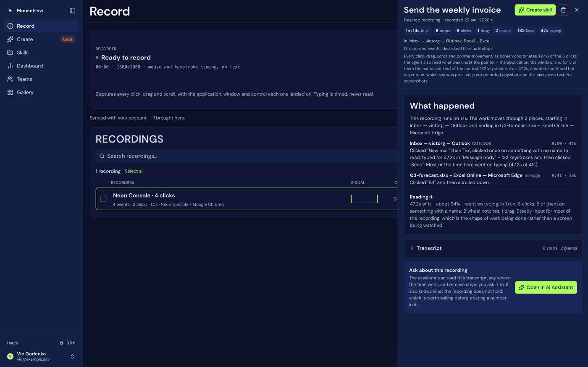

# 16 — Transcript engine

`api/_transcript.js`. Two entry points, both **pure functions over a payload**:

```
transcribe(flow)                        -> { flow, story, summary, segments, gaps }
removeSteps(payload, numbers, source)   -> { payload, removed, remaining }  (or it throws)
```

The Record screen used to say *"142 events"*, which answers nothing anybody asks. What a person wants from a
recording they are about to replay — or about to improve — is: where did this happen, what did I do there, in
what order, how long did each part take, and where did the time go. That is what this derives, and it derives
it from **the events themselves** rather than from a description written alongside them, because a description
drifts and events do not.

## Pure, and deterministic, on purpose

No database, no network, no model, no `Date.now()`, nothing random. The same recording reads the same way
every time it is opened, because a transcript somebody is going to reason about — and then **edit** — must not
change under them between two looks.

It is also what lets `removeSteps()` trust the numbering: it re-derives the transcript to find out which
underlying events step 7 was made of, and that is only sound if **step 7 is always step 7**.

## Where a step was, when saying what it was did not work

A click on something the accessibility tree does not name used to read `clicked in the page, at 99,577` —
a coordinate, and nothing a reader can place. From agent 0.24.0 such a step carries a **landmark**: the label
of the nearest control and which side of it the point fell on.

| what the recording carries | how it reads |
|---|---|
| `side=below near=Address Bar` | `clicked in the page just below "Address Bar", at 99,577` |
| `side=in near=Favorites` | `clicked on the desktop or the taskbar in "Favorites", at 300,300` |
| `namelen=1745 side=above near=Send feedback` | `clicked on a group holding 1745 characters of text, which is not recorded, just above "Send feedback", at 1144,454` |
| neither | `clicked in the page, at 99,577` — unchanged, which is what every recording made before 0.24.0 gets |

**It is not what was clicked**, and the wording keeps that distinction: `just below`, `just right of`, `in`.
A name with no side reads `near "Send"` rather than being dropped — a direction missing does not make the
label useless.

The reason it is a nearby control rather than a better name is measured and is worth knowing: the only named
thing *containing* a click in a document or a chat is the text being read, so a deeper search would record
content. See [19 — Limits](19-limits-and-known-gaps.md).

## What it refuses to do

Narrate data that is not there. That is the one failure that would make the whole feature worthless: a
confident sentence about a window title, or a typed value, that the recorder never captured. So, said once
here and repeated in `gaps` where a reader will actually see it:

- **Typing is not captured**, on either half, by design. A step from an older build or an imported file can
  still carry a value; this counts its characters rather than printing them.
- **A desktop event has no element and no window.** The `.mmmacro` line is `index | X | Y | delayMs | action`.
  Which applications were touched is known at the **recording** level only — `payload.windows`, sampled once a
  second — so a desktop recording that touched three applications gets one segment naming all three and **no
  claim about which step was in which**.
- **A desktop recording can be silently incomplete.** A medium-integrity Windows agent cannot see input while
  an elevated window has focus. The events never arrive, so nothing here can detect the hole. It says so
  rather than reading as though nothing was missing.
- **The payload is client-written and nothing validates its inner shape on the way in**, so every access is
  guarded. A row whose events are not a list gets a transcript that says exactly that, and no counts.

Time is **measured, never estimated**. Both halves record the pause before each event — the extension writes
`delay`, the desktop recorder writes `delayMs`, and reading only one would give the other half a duration of
nought — and a browser `path` event's samples each carry a `dt`. The sum is elapsed time that really elapsed.

## The thresholds

| Constant | Value | Why |
|---|---|---|
| `IDLE_MAX_MS` | 120 s | A longer pause is somebody away from the machine, not work. The part past it is **dropped** from every number and reported in `gaps`. **Duplicated from `api/insights.js` deliberately** — importing a route would tie this helper's presence to that endpoint's, and if the two ever disagree the dashboard and the transcript will report different durations for the same recording and both will look authoritative. |
| `WAIT_MIN_MS` | 1.5 s | A pause worth its own line. Below it, folded into the step it precedes — "waited 0.3s" between every click is how a transcript becomes unreadable. Above it, waiting **is** what happened. |
| `SCROLL_JOIN_MS` | 1 s | How close two scrolls have to be to read as one thing |
| `MOVE_JOIN_MS` | 1 s | Same, for movement |
| `TYPE_JOIN_MS` | 2 s | Longer on purpose: a person pauses mid-sentence, and cutting at every one of those turns two minutes of writing an email into fourteen steps that each say "typed" |
| `DOUBLE_MS` / `DOUBLE_PX` | 400 ms / 6 px | A double click. The same numbers `extension/content.js` uses, for the same reason: two presses that close in time and place are one gesture to the application receiving them. The desktop recorder does not fold them itself — it has no idea what it is pointing at — so this does. |
| `DRAG_MIN_PX` | 12 px | Below this, a press-move-release is a click with a wobble in it |
| `THIN_MIN_MS` / `THIN_PER_MINUTE` | 60 s / 6 | A recording this sparse over this long is flagged **as a question, never as a diagnosis**: either most of it was reading, or the recorder was not seeing the input |

A join is only ever allowed to swallow a gap **smaller than the join window**, which is what stops a collapsed
step from quietly containing a pause.

**The caps are on TEXT, not on steps.** No step is ever dropped or summarised away — a transcript that hides a
click is worse than a long one, and the number of steps is already bounded upstream by the payload cap. What
is capped is how much of one string travels (label 80, target 200, note 400, detail 300), because a click on a
table row records the whole row's text.

## The output



*The same derivation `mouseflow_transcript` serves to a model — [21 — MCP](21-mcp.md).*

### `flow`

`{ id, name, kind, source, created, origins, windows }` — identity, read from whichever of several field
spellings the caller used.

### `summary`

| Field | Meaning |
|---|---|
| `events` | The **raw** event count, so this reconciles with the "142 events" the recorder itself reported |
| `clicks` | One per click **step**, so a double click counts once — it was one gesture, and counting it twice would make these numbers disagree with the steps a reader can see below |
| `scrolls` | Per **event**, because a collapsed run says "scrolled down 3 times" in words |
| `drags`, `keys` | `keys` is keystrokes, not typing steps: a run of a hundred and thirty is one step and a hundred and thirty keys, and the number a reader wants beside "typed for 47s" is the second |
| `typedSeconds` | How much of the recording went on typing |
| `seconds` | Total |
| `applications` | Desktop only — distinct front-window **titles** sampled. Two documents open in one program are two of these, which is said out loud in the matching gap because the word here cannot say it. **Nought** for a browser recording, which knows pages and nothing about applications: reporting "1 application" there would be inventing the browser as a datum the payload does not carry. |
| `pages` | The mirror: browser only, nought for desktop |
| `captured` | What this recording holds, in prose |
| `gaps` | How many questions below it cannot answer |

### `captured` — three sentences for "no typing"

Because "no typing" has three different meanings and only the recorder's own answer separates them:

- `canKeys: true` → *"No typing happened: this agent watches the keyboard, and no key was pressed."*
- `canKeys: false` → *"Typing is MISSING rather than absent: this agent could not install its keyboard hook,
  so any time spent typing is in here as a pause."*
- absent → *"No typing was captured, and whether that means none happened cannot be told from this
  recording."*

Saying the first one unconditionally was a claim the file had no way to support.

### `segments`

One per place the work happened, in the order it moved: `{ n, where: { kind, label, detail }, startMs,
seconds, steps, note }`. `kind` is `app`, `page` or `unknown`.

A segment with no steps is dropped — that is a page which was named and then left, and the step that named it
is in the segment it opened.

### `steps`

`{ n, at, ms, action, what, target, note }`. `at` is milliseconds from the start; `ms` is how long that step
itself took. The internal working state (which segment, the double-click bookkeeping) is deliberately not in
the public shape.

### `story`

The recording as prose, in three kinds of chapter:

1. **`overview`** — how long it runs, and the places it moves through. Stretches and places are counted
   separately on purpose: going Outlook → Excel → Outlook is *three stretches in two places*, and calling it
   three places would be wrong while calling it two would lose that the work came back. When nothing names
   where it happened, it says so and tells you the story below is what was done rather than where.
2. **`place`** — one paragraph per segment, with where it sits on the clock so a paragraph can be found in the
   step list underneath it.
3. **`reading`** — the proportions: how much went on typing and in how many runs, how many clicks and how many
   of them on something with a name, wheel notches, drags. **The one paragraph that says more than was
   recorded, which is why it says that it is doing so.** Built from measured proportions, not from a guess
   about intent: what the numbers cannot support does not get written.

### `gaps`

First-class, not a footnote — each is a question somebody will ask, with the real count from **this**
recording, so a gap that has stopped applying shows a nought rather than being a warning nobody rereads.
Among the twenty-odd it can produce:

*Why is this recording empty? · What did I type? · Can this be replayed exactly? · Which application was each
step in? · Why do some steps still show only coordinates? · Is anything missing from this recording? · What
did the click actually do? · What did I click on? · What was on the page? · Did I drag anything? · Did
anything happen in a tab I cannot see here? · What happened during the long pauses? · Is this the whole
recording? · What are the unreadable steps? · Did the recording achieve anything?*

The last one is worth quoting, because it is the honest limit of the whole feature: *"A recording holds
input, not outcome. Nothing stored here says whether anything on the screen did what was wanted; replaying it
is the only way to find out."*

## A created skill is not transcribed as one

It holds a **goal** the agent re-runs; the steps kept beside it are evidence of what one successful run did,
not events. So `transcribe()` returns an empty story, a summary that says exactly that, and one gap pointing
at where the goal, the parameters and the runs actually live — because the agent decides its own steps each
time it runs, and they differ between runs.

## Two different unreadable payloads

They get different words, because saying "no events" for the first sends whoever reads it looking in the
wrong place:

- The payload is not an object at all → *"the stored payload is a `<type>` this cannot parse"*
- It is an object with no events list → *"the payload has no events list in it"* or *"payload.events is a
  `<type>`, not a list"*

## Removing steps

`removeSteps(payload, numbers, source)` re-derives the transcript, maps each step number back to the events it
was made of, and returns a payload without them.

- **An out-of-range number aborts the whole call.** A number the transcript does not have is evidence that the
  numbering in play is not this recording's, and quietly applying the half that happened to be in range is
  exactly the accident this guards against. The message says the real range.
- The caller (`api/transcript.js`) writes the surviving events, stamps `edits`, keeps the previous payload in
  `history`, and reports the revision back — so an edit is never silent.

`keep: [...]` is the inverse of `remove: [...]`; `undo: true` restores the last kept version.

## Where the numbers must not drift

Two pairs of constants are duplicated on purpose, and each pair has to change together or not at all:

| Duplicated | Between |
|---|---|
| `IDLE_MAX_MS` / `EVENT_GAP_MAX_MS` = 120 s | `api/_transcript.js` and `api/insights.js` |
| The edit stamp shape (`revision`, `removed`, `at`, `action`, `history`) | `api/transcript.js` and `api/_recording-tools.js` |

The second is mirrored rather than shared because the route exports only its handler. It is a cost worth
naming: if that file changes the shape and this one does not, an edit made in the chat and an edit made in the
panel will disagree about what "revision 3" is, and an undo will restore the wrong thing. Reaching the route
over HTTP instead is not available — the route authenticates the caller from the request, and a tool has a
user id but no credentials to present.
