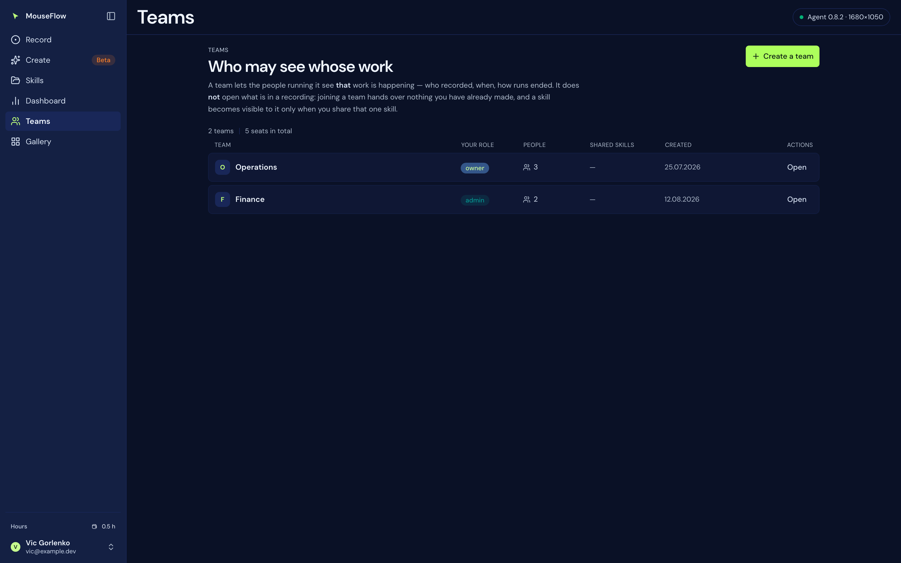
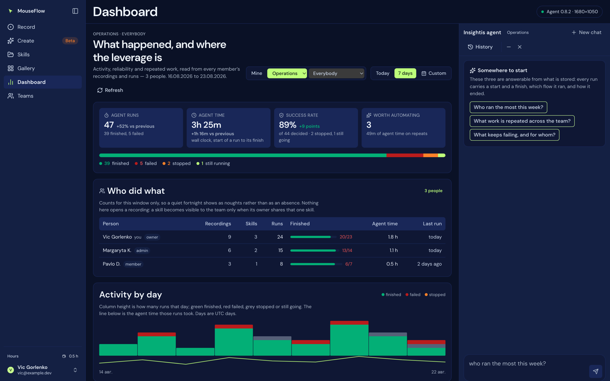

# 22 — Teams

`api/team.js`, `api/_team-scope.js`, `api/_mail.js`, `db/008_team.sql`,
`web/src/features/team/TeamView.tsx`. Who may see whose work — and, much more importantly, what a team
deliberately does **not** open.

## Where it lives

**`/team`, in the sidebar.** It was the fourth pane of the settings dialog, which was the right size while a
team was one roster you filled in once. It is the wrong size for what it is now: several teams, people being
added and moved, invitations to chase, and a dashboard scoped to each one. None of that is a *setting*, and
a dialog has no address — which matters, because the invitation email has to be able to link somewhere.

**One person can run several teams**, up to the limit below: an operations team, a finance team, one per
client. Each has its own name, its own people and its own roles, and your role can differ between them —
owner of one, member of another. The list on the left is every team you are in; the panel beside it is the
one you have open.

## What a team is for

A team lets the people running it see **that work is happening**: who recorded, when, how runs ended. That
is the question a team exists to answer, and a team that cannot answer it is a mailing list.

## What joining one does not do

**Joining a team hands over nothing you have already recorded.** Content — the events, the transcript, the
chat — stays private until you share one thing, deliberately, one at a time. That is the same rule the
gallery has always had, and the reason is the same: a membership that retroactively opened everything
somebody had ever recorded would be a surprise, and a surprise about other people's screens.

So the split is:

| | Visible to owners and admins | Visible to members |
|---|---|---|
| That a person is in the team | yes | yes |
| Their name, email, role, join date | yes | yes |
| **How much they have** — recordings, skills, runs, when they last recorded and last ran | yes | no |
| Pending invitations | yes | no |
| **Skills someone shared with this team** — name, description, owner | yes | yes |
| The events inside a recording, its transcript, its chat | **no**, unless shared | no, unless shared |

Two details in that table are worth stating rather than leaving to be inferred.

**The activity counts are account-wide, not team-scoped.** They are what that person holds in total, because
a recording does not belong to a team — it belongs to an account, and only a *share* connects one to a team.
An owner sees "twelve recordings, three skills, forty-one runs", not "twelve for us".

**Absent is not zero.** When your role may not see a member's activity, the field is missing rather than
`0`. A zero would read as "does nothing", and being quietly told the wrong thing about a colleague is worse
than being told nothing.

## Three roles, fixed

| | Can |
|---|---|
| **owner** | rename the team, delete it, and move anybody's role including another owner's — plus everything an admin can |
| **admin** | add and remove members, cancel invitations, and see everyone's activity |
| **member** | see the team's shared skills, and their own activity |

Deliberately **not** a permission table. A permission system earns its keep the day somebody needs "this
person sees the dashboard but not the transcripts", and until that request exists it is a second product to
keep correct. Growing three fixed roles into a permission table is a linear migration; going back is not,
which is why this is the direction to start in.

The roles are checked **in the queries that need them**. A team id in a query string is a claim, not a
permission: `roleOf()` turns it into one or into nothing, and every write states which roles it accepts
before it runs. As everywhere else in this product, the caller's identity comes from the credential and
never from the request.

## Inviting somebody who has no account yet

**The invitation is a row. The email is a courtesy.** That distinction is the whole design, and it is what
makes the feature safe.

The row is written first, and membership is decided by **the address on the account that opens the page** —
so you add an address; they sign up however they were going to; the next time they open Teams the invitation
is claimed. Claimed **on read** rather than on every request: joining a team matters the moment somebody
looks at one, and putting the check in the hot path would cost every `/api/sync` a query for a row that
almost never exists. Matched case-insensitively, because an address is not case-sensitive in the half that
matters and people type it both ways.

**They must make the account themselves.** Nothing here creates one for them, and the message says so.

### What the message says, and what it is worth

Adding somebody sends them one email: who added them, what a team does and does not open, a link to the
Teams page, and a line telling them to delete it if they do not recognise it. It is worded two ways — "you
are in, here it is" for somebody who already has an account with that address, and "create one with this
address" for somebody who does not.

**The link is a place, not a key.** It points at `/team` and carries no token, so opening it as the wrong
person joins nothing. That is deliberate, and it is why there is no "click here to accept": a tokenised join
link means anybody who ever sees the message — a forward, a shared inbox, a mail log — can take the seat it
was meant for. An address-bound row cannot be handed on.

Because of that, a message that never arrives costs a **conversation**, not a seat. If mail is not
configured on the deployment, everything works exactly as it did before it existed: the person adding is
told plainly that nothing was sent, and to say so themselves.

### Configuring it

**This deployment sends.** `kuswise.com` is verified with Resend and both variables below are set on
production, so adding somebody emails them. It ran unconfigured for its first day, and that state is not a
bug to be embarrassed about — it is the designed fallback, and the app said so on every screen rather than
implying a message was on its way.

It is two variables and no code:

| | |
|---|---|
| `RESEND_API_KEY` | from resend.com |
| `MAIL_FROM` | a verified sender on a domain you own, e.g. `MouseFlow <team@yourdomain>` |

There is **no default sender** on purpose. A provider's sandbox address (`onboarding@resend.dev` and its
equivalents) delivers only to the address that owns the provider account, so it looks like it is working in
testing and reaches nobody in production — which is worse than sending nothing, because nothing is at least
reported. With either variable missing, `GET /api/team` answers
`mail: { configured: false, problem: 'RESEND_API_KEY and MAIL_FROM are not set' }` and the page says so
*before* an address is typed: being told "no email was sent" after inviting four colleagues is the wrong
minute to find out.

`api/_mail.js` is the only file that knows which provider this is. It is one `fetch` against one HTTP API
with no dependency, so swapping Resend for something else is a change to that file and nothing else — the
invitation's wording, every screen and the row-is-the-invitation rule are all outside it.

An invitation that is still waiting can be sent again from the roster. Sending is capped at **25 per account
per hour**, counted from the invite rows themselves rather than from an in-process counter that a fresh
serverless instance would reset.

## Sharing a skill with the team

One skill or recording, deliberately shown to one team. The share row carries **the owner**, and not for
convenience: a share means "this person let the team see this", so when they leave the team the share leaves
with them.

It is keyed on the flow's client id — the same id `user_flow` is keyed on — and deliberately **not** a
foreign key: deleting a flow should make the share meaningless, not make the delete fail. A share whose flow
has gone is reported as `missing` rather than hidden, because a name that vanished is a thing somebody may
be looking for.

## The team's dashboard

An owner or an admin can point `/dashboard` at a whole team — the same page, the same window controls, the
same measurements, counted over every member instead of over the reader. There is a **Mine / team** switch
in the page header, and the scope lives in the address (`/dashboard?team=t_ab12`) so it can be linked, and
so a screenshot of "47 runs" can be traced back to whose. The button through to it is on this page.

It adds one section, **Who did what**: one row per member — recordings, skills, runs, how they finished,
agent time and the last run, over the window on screen. Everybody gets a row, including the people with
nothing in it, because a table that silently omits a quiet fortnight reads as a roster with somebody missing.

A second control narrows it to **one member** (`&person=<uuid>`), for the times the question is about one
person rather than the shape of the team. That is not a wider permission: it selects a subset of the
accounts the caller could already count, and the id is checked against the team's own membership. The picker
keeps every name while the counting narrows, because a filter with only the chosen person left in it is a
dead end.

Three things keep it honest:

- **The switch is only offered to somebody who owns or administers a team**, and `api/_team-scope.js` checks
  the role again on every request. A control that is merely hidden is not a rule.
- **It shows work, not screens** — and this is worth stating precisely, because a looser version of it was
  written here first and claimed too much. An owner or admin sees counts, durations and outcomes;
  application and process names, and for older desktop recordings the *window title* where nothing else
  names one; skill and recording names; the **goal wording** of repeated runs; and the **reason text** of
  failures. They do not see the events inside a recording, its transcript, its chat, or what any single step
  clicked — in any scope, filtered to one person or not. Nothing anybody typed exists anywhere to be shown.
- **The assistant follows the same scope**, through the same check. In a team scope it is given a
  *whitelist* of aggregate tools and never the ones that read a transcript or write to a recording — an
  owner editing a colleague's recording from a chat panel is not a reporting feature. The full list, and why
  it is a whitelist rather than a blacklist, is in
  [08 — Dashboard](08-dashboard.md#the-assistant-follows-the-scope).

A member who asks for the team scope — by editing the address, say — is refused **by name**: *"Only an owner
or an admin sees a team's numbers. Yours are on the personal view."* A team the caller is not in at all
answers `404`, which does not confirm that it exists.

`api/_team-scope.js` is the single derivation of all of this. Both endpoints that turn a team id into a
permission import it, because a second copy of `roleOf()` would be a second place for the rule that decides
whether one person sees another person's work to be right.

## Routes

| | |
|---|---|
| `GET /api/team` | my teams, my role in each, how many people are in them, and whether mail is configured |
| `GET /api/team?id=X` | one team: members, their activity if I may see it, pending invitations, shared skills |
| `POST /api/team` | `{ name }` — make one; I am its owner |
| `POST /api/team?id=X` | `{ email, role }` — add somebody, or invite an address with no account; emails them |
| `POST /api/team?id=X&remind=<email>` | send a waiting invitation again (owner, admin) |
| `POST /api/team?id=X&share=<flow>` | show one of **my** skills to the team |
| `PATCH /api/team?id=X` | `{ userId, role }` — change a role (owner) |
| `DELETE /api/team?id=X` | leave it |
| `DELETE /api/team?id=X&user=<uuid>` | remove somebody (owner, admin) |
| `DELETE /api/team?id=X&invite=<email>` | cancel an invitation (owner, admin) |
| `DELETE /api/team?id=X&share=<flow>` | stop showing one of my skills |
| `DELETE /api/team?id=X&team=1` | delete the team (owner) |

## Limits

| | |
|---|---|
| Team name | 60 characters |
| Teams per person | 20 |
| Members per team | 200 |
| Invitations sent | 25 per account, per hour |

## Where this meets MCP

Nowhere, and that is the answer. An AI connected over MCP is **you** — it resolves to one account and every
query filters on it. Being in a team does not widen what a connector can read, and a connector cannot see
another member's recordings any more than you can. See [21 — MCP](21-mcp.md#who-it-lets-in).
