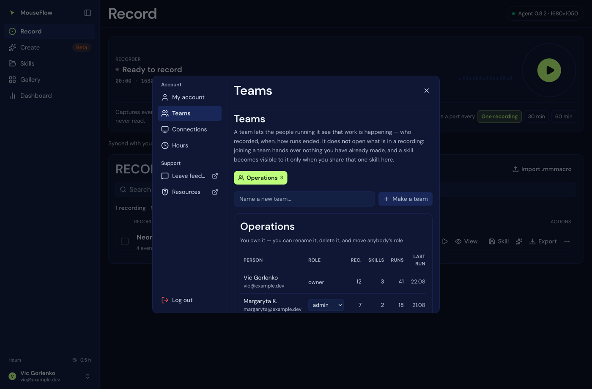

# 22 — Teams

`api/team.js`, `db/008_team.sql`, `web/src/shell/settings/TeamScreen.tsx`. Who may see whose work — and,
much more importantly, what a team deliberately does **not** open.

## What a team is for

A team lets the people running it see **that work is happening**: who recorded, when, how runs ended. That
is the question a team exists to answer, and a team that cannot answer it is a mailing list.

## What joining one does not do

**Joining a team hands over nothing you have already recorded.** Content — the events, the transcript, the
chat — stays private until you share one thing, deliberately, one at a time. That is the same rule the
gallery has always had, and the reason is the same: a membership that retroactively opened everything
somebody had ever recorded would be a surprise, and a surprise about other people's screens.

So the split is:

| | Visible to owners and admins | Visible to members |
|---|---|---|
| That a person is in the team | yes | yes |
| Their name, email, role, join date | yes | yes |
| **How much they have** — recordings, skills, runs, when they last recorded and last ran | yes | no |
| Pending invitations | yes | no |
| **Skills someone shared with this team** — name, description, owner | yes | yes |
| The events inside a recording, its transcript, its chat | **no**, unless shared | no, unless shared |

Two details in that table are worth stating rather than leaving to be inferred.

**The activity counts are account-wide, not team-scoped.** They are what that person holds in total, because
a recording does not belong to a team — it belongs to an account, and only a *share* connects one to a team.
An owner sees "twelve recordings, three skills, forty-one runs", not "twelve for us".

**Absent is not zero.** When your role may not see a member's activity, the field is missing rather than
`0`. A zero would read as "does nothing", and being quietly told the wrong thing about a colleague is worse
than being told nothing.

## Three roles, fixed

| | Can |
|---|---|
| **owner** | rename the team, delete it, and move anybody's role including another owner's — plus everything an admin can |
| **admin** | add and remove members, cancel invitations, and see everyone's activity |
| **member** | see the team's shared skills, and their own activity |

Deliberately **not** a permission table. A permission system earns its keep the day somebody needs "this
person sees the dashboard but not the transcripts", and until that request exists it is a second product to
keep correct. Growing three fixed roles into a permission table is a linear migration; going back is not,
which is why this is the direction to start in.

The roles are checked **in the queries that need them**. A team id in a query string is a claim, not a
permission: `roleOf()` turns it into one or into nothing, and every write states which roles it accepts
before it runs. As everywhere else in this product, the caller's identity comes from the credential and
never from the request.

## Inviting somebody who has no account yet

An invitation is a **row**, not an email. There is no sender in this product's control, and an invitation
that depends on a message arriving is an invitation that silently does not happen.

So: you add an address; they sign up however they were going to; the next time they open the team screen the
invitation is claimed by the address they signed up with. Claimed **on read** rather than on every request —
joining a team matters the moment somebody looks at one, and putting the check in the hot path would cost
every `/api/sync` a query for a row that almost never exists. Matched case-insensitively, because an address
is not case-sensitive in the half that matters and people type it both ways.

## Sharing a skill with the team

One skill or recording, deliberately shown to one team. The share row carries **the owner**, and not for
convenience: a share means "this person let the team see this", so when they leave the team the share leaves
with them.

It is keyed on the flow's client id — the same id `user_flow` is keyed on — and deliberately **not** a
foreign key: deleting a flow should make the share meaningless, not make the delete fail. A share whose flow
has gone is reported as `missing` rather than hidden, because a name that vanished is a thing somebody may
be looking for.

## Routes

| | |
|---|---|
| `GET /api/team` | my teams, my role in each, how many people are in them |
| `GET /api/team?id=X` | one team: members, their activity if I may see it, pending invitations, shared skills |
| `POST /api/team` | `{ name }` — make one; I am its owner |
| `POST /api/team?id=X` | `{ email, role }` — add somebody, or invite an address with no account |
| `POST /api/team?id=X&share=<flow>` | show one of **my** skills to the team |
| `PATCH /api/team?id=X` | `{ userId, role }` — change a role (owner) |
| `DELETE /api/team?id=X` | leave it |
| `DELETE /api/team?id=X&user=<uuid>` | remove somebody (owner, admin) |
| `DELETE /api/team?id=X&invite=<email>` | cancel an invitation (owner, admin) |
| `DELETE /api/team?id=X&share=<flow>` | stop showing one of my skills |
| `DELETE /api/team?id=X&team=1` | delete the team (owner) |

## Limits

| | |
|---|---|
| Team name | 60 characters |
| Teams per person | 20 |
| Members per team | 200 |

## Where this meets MCP

Nowhere, and that is the answer. An AI connected over MCP is **you** — it resolves to one account and every
query filters on it. Being in a team does not widen what a connector can read, and a connector cannot see
another member's recordings any more than you can. See [21 — MCP](21-mcp.md#who-it-lets-in).
