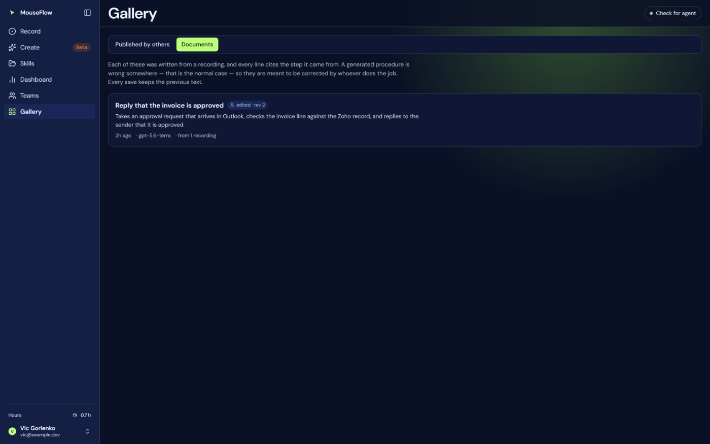
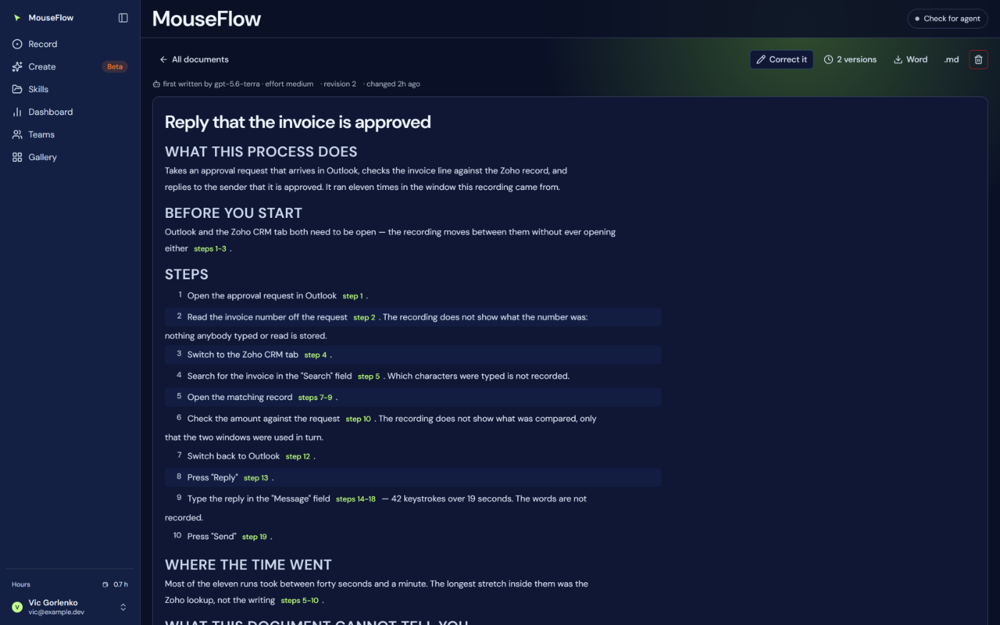
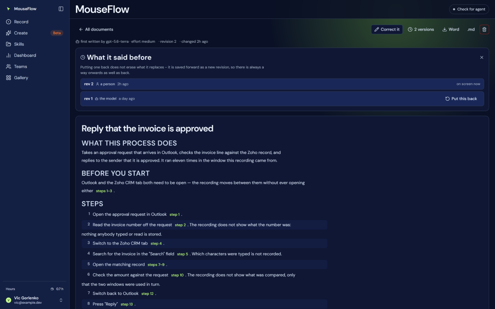

# 23 — Process documents

A written procedure, made from one recording, kept as a row and correctable by hand.

This page existed nowhere until 1 September 2026: the feature shipped, the public docs never mentioned it,
and this set did not either. It was found the way such things are found — somebody looked at the site and
asked where the documents were.

## Why an object and not a chat answer

Documenting a process was asked for as *the thing that makes automation possible*, and the two candidate
shapes were an option in the assistant and a document you can keep. A chat answer is read once and scrolled
past. A procedure is edited, disagreed with, corrected by somebody who actually does the job, and read again
next quarter — so only the second shape supports **being wrong and then fixed**, which is the normal life of
a written procedure and of a generated one most of all.

The reasoning is written where it binds: at the top of `db/017_user_doc.sql`, `api/_docs.mjs` and
`web/src/features/docs/DocsView.tsx`.

## How one comes to exist

**Only by asking the assistant**, which calls `write_process_doc` (`api/_recording-tools.js`). There is no
button on the documents screen, and its empty state says so rather than offering one: writing a document
means reading a transcript and paying for a model call, and both belong where the assistant's rules and
budget already apply. A second route to the same action would be a second place where "may this happen" is
decided.

| | |
|---|---|
| Written from | the transcript, through **the same `get_transcript` the assistant uses** — never the payload and never a second summariser |
| Model | `gpt-5.6-terra` at effort `medium`, **pinned** in `api/_docs.mjs` and written into the row |
| Transcript budget | `DOC_TRANSCRIPT_BUDGET` = 120,000 characters, separate from the chat ceiling |
| Output ceiling | `DOC_TOKENS` = 6,000 |
| Id | `doc_<random>`, minted on the server |

**Why the transcript budget is its own number.** The chat ceiling is chosen for a conversation, where a
result stays in context for every later turn. Writing a document is one call with no turn after it.
Measured on a live recording: at the chat ceiling **nought of 73 steps** reached the writer — it got stretch
headings and a request to describe a procedure from them, and answered, honestly, that the transcript held
no individual steps. At this ceiling all 73 steps and all 12 stretches arrive, and it weighs 27 KB.

**Why a different model from the assistant.** Asked for explicitly, and it is pinned rather than read from
the deployment's `OPENAI_MODEL` so that a document is reproducible from its own row: a document written at
whatever the environment happened to say is one whose provenance nobody can reconstruct.

## What the prompt will not let it do

Every rule in `DOC_SYSTEM` is there because its absence has a specific failure, and they are the failures
this whole product is built against — a plausible number, a step that never happened, a procedure nobody can
check.

- **Every instruction cites its step**, inline: `[step 41]`, `[steps 41-48]`.
- **Write nothing you did not read.** Where the transcript does not say *why*, the document says the
  recording does not show why and carries on. It does not supply a reason.
- **Omitted ranges get their own section.** When the transcript could not be delivered whole, the document
  must name the ranges it did not see. A procedure that looks complete and is not is worse than a short one.
- **Typed text is not recorded**, so the document names the field and states that the content is not
  recorded — as a stated limitation, not only as a remark in passing. (The exact keyboard rule is in
  [17 — Privacy](17-privacy-security.md#the-keyboard-exactly); the prompt used to say "and which key",
  which was the loose half of a claim that matters.)
- **Where it happened is part of the instruction.** A stretch whose `where` carries a `url` is named as a
  Markdown link, using the url exactly as given — no inventing, no shortening to the host, no repeating it
  on every step. The urls carry no query string (removed in the agent), so a link goes to the page and not
  to the record that was open; the document says that once, in its limitations.
- **A fixed shape**: `# title`, then *What this process does*, *Before you start*, *Steps*, *Where this
  runs*, *Where the time went*, *What this document cannot tell you*. The last is **always present and
  never empty** — there is always at least the typing.
- No preamble, no closing offer, no note about being an AI.

The title is taken from the body rather than asked for separately: two fields for one name is two names, and
the one somebody will edit is the heading they can see.

## The screen

`/gallery?tab=documents` for the list — documents share the Gallery with published skills because both are
things to *read* rather than things to run, and the shelf is in the address so either can be linked to.
`/docs/$docId` for one document. `DocsView` serves both, and renders the Markdown itself: the bodies are
written to one shape by one prompt, so rendering them is a fold over lines, and a dependency for six cases
would be larger than the feature. The one thing rendering has to get right is the citations, and no library
would know about those.

| Control | What it does |
|---|---|
| **Correct it** | edits the body as the Markdown it is stored as |
| **N versions** | *"What it said before"*, with put-back |
| **Word** | `.docx`, built in the browser from `api/_docx.mjs` — the same module the Node suite unzips and parses |
| **.md** | the stored text, not a conversion of it |
| **delete** | two presses; soft delete (`deleted_at`) |

`api/docs.js` is the page's half — list, read, save, revert, delete. It does **not** write one.

## Every save keeps what was there

`revision` is bumped and the previous text is appended to `user_doc_version`; nothing is overwritten except
the row saying which revision is current. Each version records whether it came from `'model'` or a
`'person'`, which is the distinction the whole screen exists for: the list badge reads **as written** at
revision 1 and **edited · rev N** after somebody has been through it.

## Scope, and the limits

Every statement filters on the id `whoIsCalling()` returned, **inside the WHERE clause**; no code path reads
an account id from the request. A document belonging to somebody else and a document that does not exist
answer the same 404 on purpose — different answers would confirm that an id exists.

| | |
|---|---|
| `BODY_MAX` | 400,000 characters |
| `TITLE_MAX` | 200 |
| `LIST_MAX` | 200 documents |
| `VERSIONS_MAX` | 100 revisions travel with one document |
| `flow_ids` | the recordings it was written from, by `client_id`, **not** a foreign key: deleting a recording leaves the document readable with unresolvable citations rather than taking it with it |

Documents are **not** shared by a team and **not** published to the gallery. What travels is what somebody
exports and sends.

## See also

- [16 — Transcript](16-transcript.md) — what a document is written from
- [17 — Privacy](17-privacy-security.md) — the keyboard rule a document has to state
- [08 — Dashboard](08-dashboard.md) — where the assistant that writes one lives
- The public page: `documents.md` in `Aborsen/MouseLanding`, at `/docs/documents`
