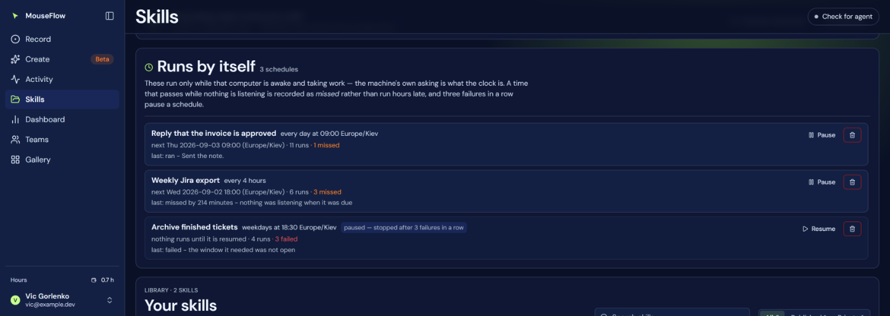
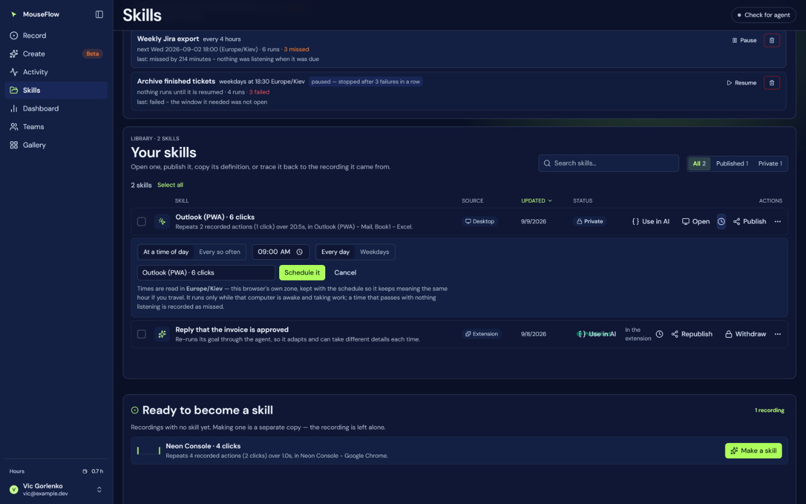

# 24 — Schedules

A skill that runs without anybody asking: at a time of day, every so often, or once at a stated instant.

Two doors, like everything else here — a row on the **Skills** page, and three MCP tools so a chat can set
one up in the sentence somebody said it in. Both go through the same rule parser and the same clock, so
"every weekday at 09:00" typed into a form and said to an assistant mean the same thing.

## The clock is the machine's own poll, not a cron

This is the one design decision the whole page rests on, and it is the opposite of the obvious build.

A run drives **a real mouse on somebody's computer**. It can only happen while that computer is awake and
taking work. A cloud timer that fires at 03:00 fires into nothing: it would mark the run as started, find no
claimer, and either fail or sit in a queue until morning and then move the mouse under somebody's hands.

What *does* know a machine is awake is the machine. The agent's courier already asks the account for work
every **3 seconds** (`IdleSleepSeconds`, [10 — Agent protocol](10-agent-protocol.md)), and that question is
proof of life. So the due check rides along on it: `POST /api/mcp?worker=claim` runs `dueNow()`
(`api/mcp.js`) immediately after stamping the worker, and anything due becomes an **ordinary `run_queue`
row**.

There is deliberately **no `crons` key in `vercel.json`**, and the suite pins its absence.

| | |
|---|---|
| What ticks it | the agent's own claim poll, every 3 seconds while it is running |
| What a due schedule becomes | an ordinary `run_queue` row with `schedule_id` set — see [15 — Data model](15-data-model.md) |
| Checked per tick | at most 8 due schedules, one busy query for the account |
| If the machine is off | nothing is queued, and the time is recorded as **missed** |
| If the migration is not applied | the claim path swallows the error, so manual runs keep working |

Because a scheduled run is an ordinary queue row, everything downstream — claiming, reporting, the run
history, the spend guards — works without a single branch for "scheduled". The only thing that knows the
difference is the outcome report, which finds `schedule_id` and writes the result back to the schedule.

## What you can ask for

Three shapes, in the smallest vocabulary that covers what people actually ask. A cron string was the
alternative and was rejected on purpose: `0 * * * *` cannot be read by the person who has to trust it, and
this product's whole argument is that a claim you cannot check is worthless.

| Kind | Said as | Meaning |
|---|---|---|
| `every` | `"30m"`, `"1h"`, `"6h"`, `"1d"` | that far apart, counted **from each run** |
| `daily` | `at: "09:00"` with `days: "all"` or `"weekdays"` | that local time of day, in the schedule's zone |
| `once` | an ISO instant | once, then it pauses itself with "it was a one-off, and it has run" |

**Floor: 15 minutes.** Not for load — a run occupies the mouse of a machine somebody is sitting at, and
anything faster is a computer nobody can work at. It also spends: a goal skill pays a model per step, and
"every five minutes" is 288 runs a day whose bill arrives after the consent.

**Ceiling: 30 days.** Longer than that is a reminder, and a reminder belongs in a calendar.

## The time zone is stored, because nothing else here has one

The browser knows its own zone; the server knows none. `"09:00"` with no zone silently means 09:00 UTC,
which for the person who asked for nine in the morning is the middle of the night — so:

- The **Skills page** sends `Intl.DateTimeFormat().resolvedOptions().timeZone` and *shows* which zone it
  sent, under the fields where the decision is being made.
- The **MCP tool** requires `zone` alongside `at` and refuses without it rather than defaulting to UTC.
- The zone is **stored with the schedule** (`user_schedule.zone`), not resolved at fire time, so a schedule
  made on a laptop that later changes country keeps meaning the 09:00 it was created to mean.
- Next-run times are rendered **in the schedule's zone by the server** (`whenSaid`), so opening the app in
  London does not retell Kyiv's nine as seven.

The arithmetic lives in `api/_schedule.mjs` with no dependencies — `Intl.DateTimeFormat` with a `timeZone`
and a two-pass offset resolution — and is checked by execution in `api/_test-schedule.mjs` (42 checks).
Three of those are the cases nobody can verify by eye:

- Kyiv 09:00 is `07:00Z` in winter and `06:00Z` in summer, and both render as local 09:00.
- On 2026-03-29 the local time 03:30 **does not exist**; a schedule set for it lands at 04:30 local.
- In the autumn overlap the hour occurs twice, and the schedule fires **once**.

## What happens when the machine was asleep

This is the most common outcome any household schedule has, and it is the failure this feature would
otherwise ship with: a schedule that silently does nothing, discovered a week later.

`decide()` (`api/_schedule.mjs`) has four answers:

| Verdict | When | What is recorded |
|---|---|---|
| **run** | due, and nothing else is running | a queue row; `runs + 1`; "started on time" or "started N minutes late" |
| **skip** | the account is already busy with a run | the tick is yielded — a repeat waits for the next one, a one-off keeps its instant |
| **miss** | more than **30 minutes** late (`CATCH_UP_MS`) | `misses + 1` and "missed by N minutes — nothing was listening when it was due" |
| **pause** | a `once` whose moment passed, three failures in a row, or a deleted skill | `paused` with the reason in words |

**Why 30 minutes.** "Due at 09:00, laptop opened at 09:20" is exactly the case where somebody still expects
the work to happen. Opened at 14:00, doing the morning's work retroactively is almost always worse than not
doing it — so it is marked missed and waits for tomorrow.

**Why misses are counted on the schedule and not in the run history.** A miss never becomes a run. There is
nothing in [08 — Dashboard](08-dashboard.md) or the run history to see, so the count and the last outcome in
words live on the schedule row, and the strip on the Skills page shows both beside the number of runs.

**Three failures in a row pause it.** Written back from the report path in `api/mcp.js`: a success sets
`fails = 0`, a failure increments it, and the third sets `paused` with "stopped after 3 failures in a row".
Without this, a broken schedule runs hourly forever, fails hourly forever, and bills for it.

**One mouse.** The same rule as a manual run: while anything is `queued` or `claimed` for the account,
nothing else is queued. Due schedules yield the tick rather than piling up.

## On the Skills page

The strip sits **above** the library, and draws nothing at all when there are no schedules. Each row says
the rule in the same words the MCP tools print (`ruleSaid`), the next run in the schedule's zone, the last
outcome, and the counts — runs, missed, failed.

- **Pause / Resume.** Pausing keeps the rule and runs nothing. Resuming **recomputes** the next time: the
  saved one leaked into the past while it was paused, so without recomputing it would either fire instantly
  or be marked missed at the moment somebody pressed Resume.
- **Remove** asks first, and the question says the skill itself stays.
- The **clock button** in each skill row opens the form: a time of day with every-day/weekdays, or an
  interval; a label, so two schedules on one skill can be told apart; and the zone, shown.

A refusal from the server is shown *in the form*, not as a banner at the top of the page, because it is
almost always about the field just chosen ("every 5 minutes is too often").

## A goal that says "at 19:41"

A run can turn itself into a schedule. When a goal given to the decision loop names a later time, the model
is told to call `defer_until` rather than wait — the loop has no clock of its own and used to build one out
of PowerShell — and the driver makes a `once` schedule for that instant with the run's own `flow_id`,
`tool_name` and `args`, then ends the run — announced and logged like any other finish, with a summary that begins *Set aside until …* so the row cannot read as a goal already carried out. On the Create page the dictated goal is first
saved as a goal skill so there is something to point at. The whole story is in
[05 — Create](05-create.md#a-goal-that-names-a-time); the instant is `deferInstant()` in
`api/_schedule.mjs`, tested beside the rest.

## Watching one run

A scheduled run is driven by the agent, not by a page — so the Create page polls for it and draws it as a
turn card of its own, captioned *by itself, from a schedule*, with the steps as they happen and the same
finish announcement a run you started gets. See [05 — Create](05-create.md#runs-the-machine-does-by-itself-show-up-here-too).

## The three tools

Named separately rather than one tool with an `action` field, for the reason every other tool here is:
an instrument is chosen by its name. Full descriptions in [21 — MCP](21-mcp.md).

| Tool | What it does |
|---|---|
| `mouseflow_schedule` | set one up: `skill`, plus `every` / `at` + `days` / `once`, `zone`, `label`, `arguments` |
| `mouseflow_schedules` | what is set to run by itself, when it next runs, and what happened last time |
| `mouseflow_unschedule` | `pause: true` / `false`, or omit `pause` to remove it. The skill is untouched either way |

Every confirmation states the condition out loud — that a scheduled run happens only while that machine is
awake and taking work — so a chat cannot promise a run on a closed laptop.

## The HTTP surface

`/api/schedules` (`api/schedules.js`) serves the page and nothing else:

| | |
|---|---|
| `GET` | the account's schedules, paused ones last |
| `POST` | with no `?schedule=` — create; with one — pause or resume |
| `DELETE ?schedule=<id>` | soft-delete (`deleted_at`) |

It exists **separately from the MCP tools** because the two have different bearers: the page arrives with a
session cookie, MCP with a device token or an OAuth access token, and `whoIsCalling` is the only thing that
decides whose schedules these are. Every statement filters on that id inside the `WHERE`; a foreign id and a
missing one get the **same 404**, so a different answer cannot confirm that an id exists. A deployment
without `db/018_user_schedule.sql` applied gets a 503 that says which migration is missing rather than a
500 that looks like a broken page.

## What this deliberately does not do

- **It does not wake the machine.** No wake-on-LAN, no scheduled task in the OS. If the computer is off at
  09:00, 09:00 was missed, and the app says so rather than running it at noon.
- **It does not catch up.** One missed time is one missed time, not a queue of five to work through when the
  laptop opens.
- **It does not run two things at once**, and will not, for as long as there is one mouse per machine.
- **It has no cron field** anywhere — not in the form, not in the tool schema, not in the table.
- **It does not choose a zone for you.** A time of day without a zone is refused, in both doors.

## Where the reasoning is written

| | |
|---|---|
| `db/018_user_schedule.sql` | why a schedule is a row and not a cron job, and why `schedule_id` is a column on `run_queue` rather than a field inside `args` |
| `api/_schedule.mjs` | the whole of the time arithmetic, the limits, and `decide()` |
| `api/_test-schedule.mjs` | 42 executable checks: DST both ways, the nonexistent hour, midnight, weekday sets, parsing and refusals |
| `api/mcp.js` | `dueNow()` on the claim path, the three tools, and the outcome written back to the schedule |
| `api/schedules.js` | the page's route, and why it is not the same route as the tools |
| `web/src/features/skills/Schedules.tsx` | what the strip must say, and why the zone is shown rather than assumed |
