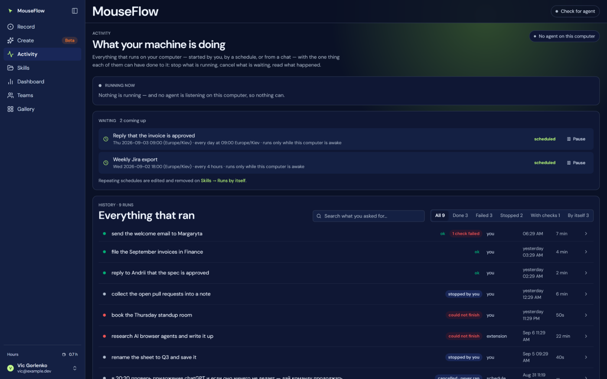

# 26 — Activity

What your machine is doing now, what it is about to do, and everything it has done — on one page, with the
one thing each of them can have done to it where the thing is.

## Why a page

A run set itself a one-off every quarter hour and ran all night. The person watching asked the obvious
question — *how do I cancel this?* — and the honest answer was scattered across three places: the one-off
schedule was a row on **Skills → Runs by itself**; the queued work was visible only to `mouseflow_status`;
the history was the panel on the right of **Create**, and only while Create was open. None of the three
answered the question whole, and none had a button beside the thing being asked about.

## Three sections, each of which collapses honestly

| Section | Holds | Action | When empty |
|---|---|---|---|
| **Running now** | the job a machine has claimed, with its last steps live | **Stop** | one line — and it says whether that is because nothing was asked or because *no agent is listening on this computer* |
| **Waiting** | queued jobs, and schedules whose next run is set | **Cancel** a queued job; **Cancel** a one-off schedule; **Pause** a repeating one | not drawn at all |
| **History** | every run, plus queue rows that never became a run | expand: steps, checks, kept frames | "Nothing has run yet." |

Repeating schedules are *paused* here, never removed: deleting a rule that lives on the Skills page from
another page with one button is too easy; the trash is where the rule lives.

## The history is the journal plus the queue

`user_run` holds what **happened**. A job cancelled before a machine took it, or one that failed at the fence
(*the skill was deleted between the ask and the run*), never became a run and is not in the journal — yet the
person asking *what became of my request from the chat* has to see it. So the page reads
`GET /api/mcp?live=1&days=30` and merges: a queue row whose id has a `user_run` (`client_id = run_queue.id`)
contributes only its source; a row without one stands for itself as *cancelled · never ran* or *could not
start*. Thirty days, because that is how long kept frames live and further back there is nothing to
diagnose with.

## The vocabulary

One file (`web/src/features/activity/status.ts`), and **two questions never share a chip**: *did the agent
finish* and *did the product pass*. A run can carry `ok` and, beside it, `1 check failed` — that is a found
bug, not a contradiction ([25 — Checks and tests](25-tests.md)).

| Chip | Means | Action |
|---|---|---|
| `running` | a machine has it now | Stop |
| `queued` | waits for a free machine — one mouse at a time | Cancel |
| `scheduled` | starts at a named time, if the machine is awake then | Cancel (one-off) · Pause (repeating) |
| `ok` | the agent finished what was asked | — |
| `ok` + `N checks failed` | finished, and the product did not do what it should | open the frame |
| `set aside → 10:47` | the goal named a later time and became a one-off schedule | — |
| `could not finish` | the agent gave up, with its reason — not a verdict on the product | — |
| `stopped by you` | a person pressed Stop part-way | — |
| `cancelled · never ran` | removed from the queue before it started | — |
| `could not start` | failed at the fence before any step | — |

Words, not state names: *could not finish*, never `failed`; *stopped by you*, never `stopped`. A person
reading the page at nine in the morning should not have to translate.

**Source** is a second axis and is never folded into the status: *you* · *schedule* · *chat* (MCP) ·
*extension*. The **By itself** filter is schedule + chat.

## One poll for the whole app

`web/src/lib/live.ts` asks `/api/mcp?live=1` every five seconds **while anything is listening**, and both
the page and the sidebar read the same answer — the sidebar's count beside *Activity* is running + queued,
never the history. Two polls would be twice the load on a route with one ceiling per account, and two
pictures that disagree for a second.

## Cancelling one thing

`POST /api/mcp?cancel=<jobId>` — the page's door, with a session cookie. `mouseflow_stop` cancels
*everything* and arrives with a token; a person on this page needs a button beside one row. Same SQL as the
stop, narrowed to an id: a queued job disappears; a claimed one stops at the next step the machine checks
(`?worker=state`). A foreign id and a missing one get the same answer — *nothing to cancel* — for the reason
every other route here does that.

## Where the reasoning is written

| | |
|---|---|
| `web/src/features/activity/ActivityView.tsx` | the three sections and why each collapses the way it does |
| `web/src/features/activity/status.ts` | the vocabulary, and why two questions never share a chip |
| `web/src/lib/live.ts` | one poll, shared |
| `api/mcp.js` → `?live=1&days=`, `?cancel=` | the queue's history window, and cancelling one |
